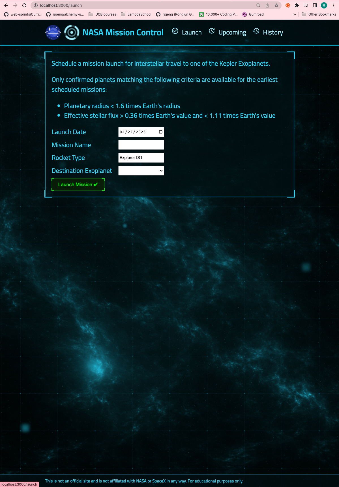
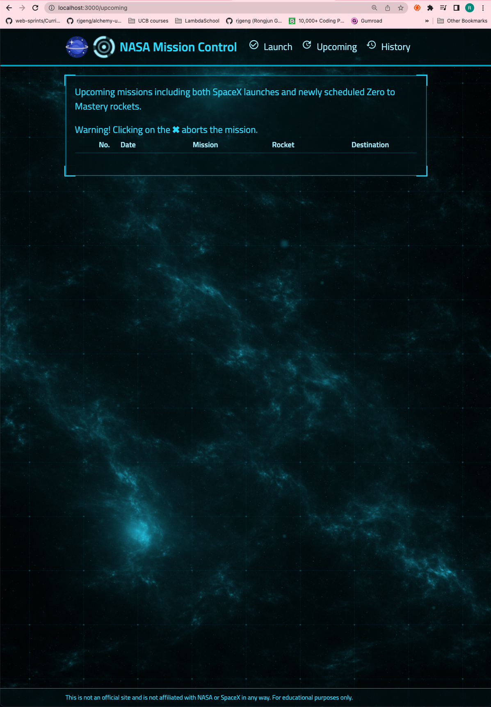
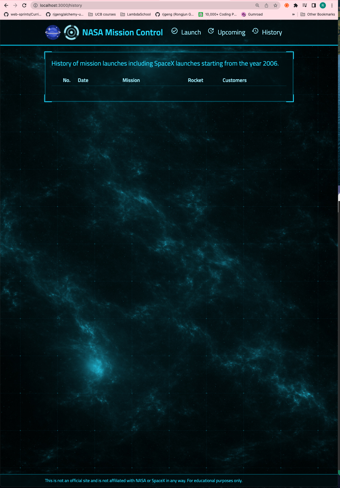

# 103. NASA Dashboard Front End Setup

-   [Create React App Website](https://create-react-app.dev/)

-   [Arwes Sci-Fi UI Web Framework](https://github.com/arwes/arwes)

-   [nasa-front-end.zip](https://beatlesm.s3.us-west-1.amazonaws.com/Complete-NodeJS-Developer-in-2023/nasa-front-end.zip)

https://github.com/odziem/nasa-project

  
 103. NASA Dashboard Front End Setup 

  - copy unzipped files into `client` folder

  - install package `npm install` 

  - create gitignore file `npx gitignore node` 

  - run client `npm start`

  

    
    
    

 

  
 Section 9: NASA Project 

  - [Codebase: nasa-project](../src/9_nasa-project)

---

[Previous](./102_Introduction-%26-Architecture.md) | [Next](./104_NASA-Dashboard-Functionality.md)