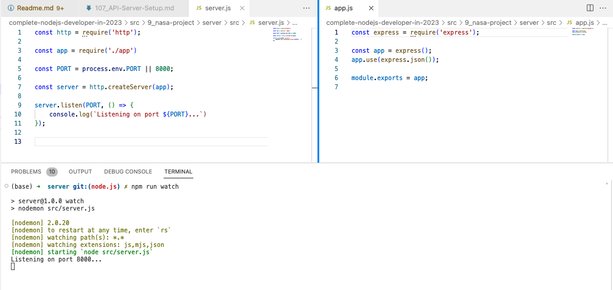

# 107. API Server Setup

## NASA API Server Setup 

- install package.json and create .gitignore file 
  ```
  npm init -y 
  npx gitignore node
  ````

  - install express `npm i express` 
 
  - install nodemon `npm i nodemon --save-dev`

  - add script: `"watch": "nodemon server.js",` in `package.json`

https://github.com/odziem/nasa-project

<details>
  <summary> NASA API Server Setup </summary>

-   `server.js`
```
const http = require('http');

const app = require('./app')

const PORT = process.env.PORT || 8000;

const server = http.createServer(app);

server.listen(PORT, () => {
    console.log(`Listening on port ${PORT}...`)
});


```

-   `app.js`
```
const express = require('express');

const app = express();
app.use(express.json());

module.exports = app;

```

-   run `npm run watch`

<p align="center" >
    
</p> 

</details>  

<details>
  <summary> Section 9: NASA Project </summary>

  - [Codebase: nasa-project](../src/s9_nasa-project/)

</details>

---

[Previous](./106_React.js-Front-End-Code-Walkthrough.md) | [Next](./108_Environment-Variables-On-Windows.md)