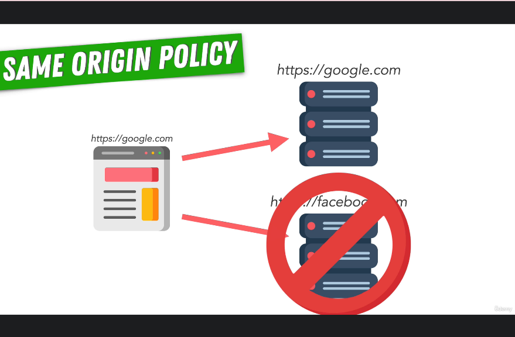
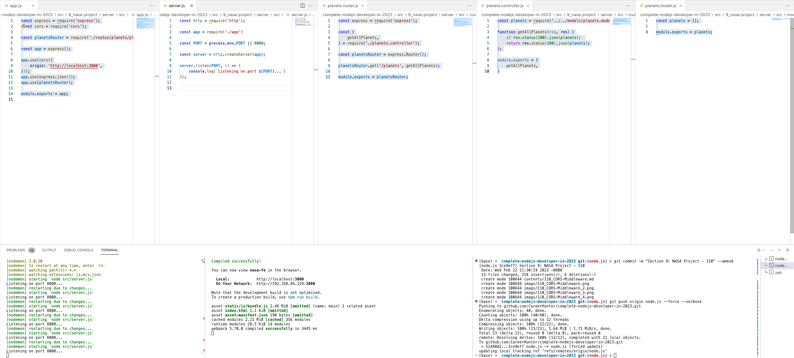
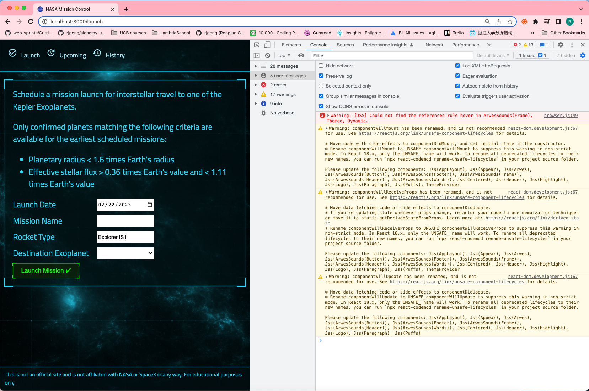

# 110. CORS Middleware

-   [CORS Middleware Package](https://www.npmjs.com/package/cors)

<p align="center" >
    
    
</p> 

---

- [78. Cross Origin Resource Sharing (CORS)](./78_Cross-Origin-Resource-Sharing-(CORS).md)

---

<p align="center" >
    
    
</p>

---

- install CORS on **server** `npm i cors`
```
npm i cors
```

- update `app.js`

```
const express = require('express');
const cors = require('cors');

const planetsRouter = require('./routes/planets/planets.router');

const app = express();

app.use(cors({
    origin: 'http://localhost:3000',
}));
app.use(express.json());
app.use(planetsRouter);

module.exports = app;
```

---

https://github.com/odziem/nasa-project

<details>
  <summary> NASA API Server Setup </summary>

**client**

-   `client/src/hooks/request.js`
```
const API_URL = 'http://localhost:8000'

// Load planets and return as JSON.
async function httpGetPlanets() {
  const response = await fetch(`${API_URL}/planets`);
  return await response.json();
}

async function httpGetLaunches() {
  // TODO: Once API is ready.
  // Load launches, sort by flight number, and return as JSON.
}

async function httpSubmitLaunch(launch) {
  // TODO: Once API is ready.
  // Submit given launch data to launch system.
}

async function httpAbortLaunch(id) {
  // TODO: Once API is ready.
  // Delete launch with given ID.
}

export {
  httpGetPlanets,
  httpGetLaunches,
  httpSubmitLaunch,
  httpAbortLaunch,
};
```

-  under client folder run client `npm start`

```
Compiled successfully!

You can now view nasa-fe in the browser.

  Local:            http://localhost:3000
  On Your Network:  http://192.168.84.229:3000

Note that the development build is not optimized.
To create a production build, use npm run build.

asset static/js/bundle.js 2.48 MiB [emitted] (name: main) 1 related asset
asset index.html 2.1 KiB [emitted]
asset asset-manifest.json 190 bytes [emitted]
cached modules 2.21 MiB (javascript) 28.5 KiB (runtime) [cached] 370 modules
webpack 5.70.0 compiled successfully in 1966 ms
```

**server**

-   `server/src/server.js`
```
const http = require('http');

const app = require('./app')

const PORT = process.env.PORT || 8000;

const server = http.createServer(app);

server.listen(PORT, () => {
    console.log(`Listening on port ${PORT}...`)
});

```

-   `server/src/app.js`
```
const express = require('express');
const cors = require('cors');

const planetsRouter = require('./routes/planets/planets.router');

const app = express();

app.use(cors());
app.use(express.json());
app.use(planetsRouter);

module.exports = app;
```

-   `server/src/routes/planets/planets.controller.js`
```
const planets = require('../../models/planets.model')

function getAllPlanets(req, res) {
    // res.status(200).json(planets); 
    return res.status(200).json(planets);
};

module.exports = {
    getAllPlanets,
}
```

-   `server/src/routes/planets/planets.router.js`
```
const express = require('express');

const {
    getAllPlanets,
} = require('./planets.controller');

const planetsRouter = express.Router();

planetsRouter.get('/planets', getAllPlanets);

module.exports = planetsRouter;
```

-   `server/src/models/planets.model.js`
```
const planets = [];

module.exports = planets;
```

-  under server folder run Server `npm run watch`

```
> server@1.0.0 watch
> nodemon src/server.js

[nodemon] 2.0.20
[nodemon] to restart at any time, enter `rs`
[nodemon] watching path(s): *.*
[nodemon] watching extensions: js,mjs,json
[nodemon] starting `node src/server.js`
Listening on port 8000...
```

<p align="center" >
    
    
</p> 

</details>  

<details>
  <summary> Section 9: NASA Project </summary>

  - [Codebase: nasa-project](../src/9_nasa-project)

</details>

---

[Previous](./109_GET-planets.md) | [Next]()