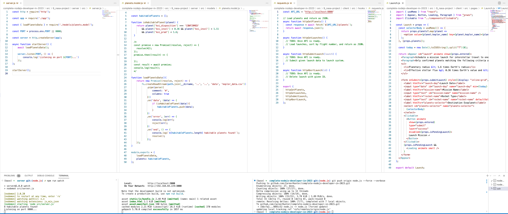
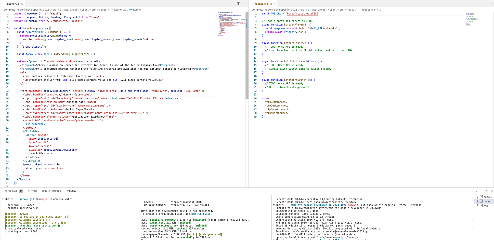
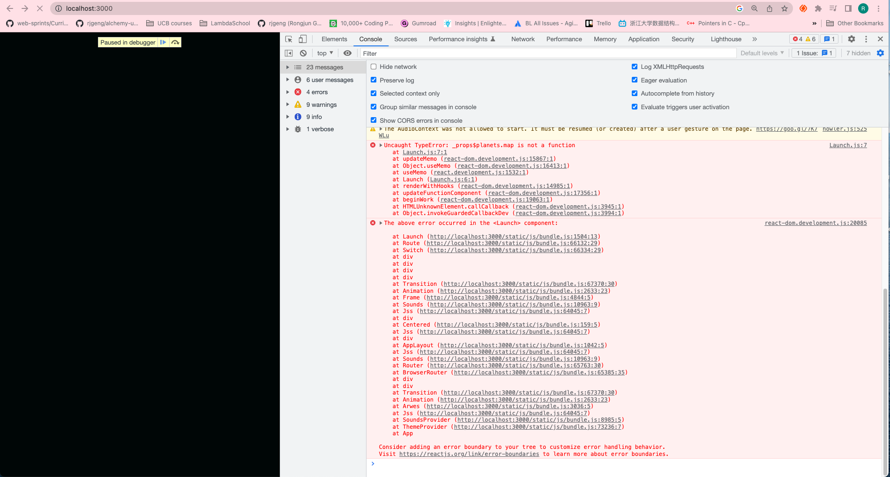
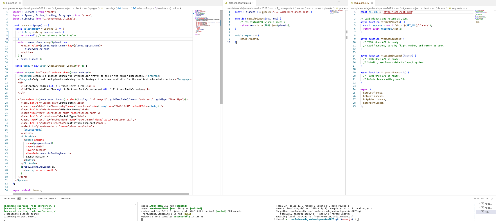
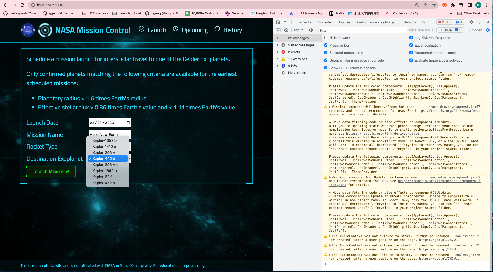

# 113. Loading Data On Startup

-   [Bonus: Node Streams Promises API](https://nodejs.org/api/stream.html#stream_streams_promises_api)


https://github.com/odziem/nasa-project

-   `server/src/server.js`

-   `server/src/routes/planets/planets.controller.js`

-   `server/src/models/planets.model.js`

-   `server/src/data/kepler_data.csv`

-   `client/src/pages/Launch.js` 

<details>
  <summary> NASA API Server Setup </summary>

**server**

-   `server/src/server.js`
```
const http = require('http');

const app = require('./app');

const { loadPlanetsData } = require('./models/planets.model');

const PORT = process.env.PORT || 8000;

const server = http.createServer(app);

async function startServer() {
    await loadPlanetsData();
    
    server.listen(PORT, () => {
        console.log(`Listening on port ${PORT}...`)
    });
};

startServer();
```

-   `server/src/app.js`
```
const express = require('express');
const cors = require('cors');

const planetsRouter = require('./routes/planets/planets.router');

const app = express();

app.use(cors());
app.use(express.json());
app.use(planetsRouter);

module.exports = app;
```

-   `server/src/routes/planets/planets.controller.js`
```
// const planets = require('../../models/planets.model');
const { planets } = require('../../models/planets.model');

function getAllPlanets(req, res) {
    // res.status(200).json(planets); 
    return res.status(200).json(planets);
};

module.exports = {
    getAllPlanets,
}
```

-   `server/src/routes/planets/planets.router.js`
```
const express = require('express');

const {
    getAllPlanets,
} = require('./planets.controller');

const planetsRouter = express.Router();

planetsRouter.get('/planets', getAllPlanets);

module.exports = planetsRouter;
```

-   `server/src/models/planets.model.js`
```
const  { parse } = require('csv-parse');
const fs = require('fs');
const path = require('path');

const habitablePlanets = [];

function isHabitablePlanet(planet) {
    return planet['koi_disposition'] === 'CONFIRMED'
        && planet['koi_insol'] > 0.36 && planet['koi_insol'] < 1.11
        && planet['koi_prad'] < 1.6;
  }

  /* 
  const promise = new Promise((resolve, reject) => {
    resolve(42);
  });
  promise.then((result) => {

  });
  const result = await promise;
  console.log(result);
  */

function loadPlanetsData(){
    return new Promise((resolve, reject) => {
        fs.createReadStream(path.join(__dirname, '..', '..', 'data', 'kepler_data.csv'))
            .pipe(parse({
                comment: '#',
                columns: true
            }))
            .on('data', (data) => {
                if (isHabitablePlanet(data)){
                    habitablePlanets.push(data);
                }
            })
            .on('error', (err) => {
                console.log(err);
                reject(err);
            })
            .on('end', () => {                
                console.log(`${habitablePlanets.length} habitable planets found!`);
                resolve();
            });
    });
}

module.exports = {
    loadPlanetsData,
    planets: habitablePlanets,
};
```

-  under server folder run Server `npm run watch`

```
> server@1.0.0 watch
> nodemon src/server.js

[nodemon] 2.0.20
[nodemon] to restart at any time, enter `rs`
[nodemon] watching path(s): *.*
[nodemon] watching extensions: js,mjs,json
[nodemon] starting `node src/server.js`
8 habitable planets found!
Listening on port 8000...
```

<p align="center" >
        
</p> 

---

</details>  

<details>
  <summary> NASA Front End Setup </summary>

**client**

-   `client/src/hooks/request.js`
```
const API_URL = 'http://localhost:8000'

// Load planets and return as JSON.
async function httpGetPlanets() {
  const response = await fetch(`${API_URL}/planets`);
  return await response.json();
}

async function httpGetLaunches() {
  // TODO: Once API is ready.
  // Load launches, sort by flight number, and return as JSON.
}

async function httpSubmitLaunch(launch) {
  // TODO: Once API is ready.
  // Submit given launch data to launch system.
}

async function httpAbortLaunch(id) {
  // TODO: Once API is ready.
  // Delete launch with given ID.
}

export {
  httpGetPlanets,
  httpGetLaunches,
  httpSubmitLaunch,
  httpAbortLaunch,
};
```

-  under client folder run client `npm start`

```
Compiled successfully!

You can now view nasa-fe in the browser.

  Local:            http://localhost:3000
  On Your Network:  http://192.168.84.229:3000

Note that the development build is not optimized.
To create a production build, use npm run build.

asset static/js/bundle.js 2.48 MiB [emitted] (name: main) 1 related asset
asset index.html 2.1 KiB [emitted]
asset asset-manifest.json 190 bytes [emitted]
cached modules 2.2 MiB [cached] 355 modules
runtime modules 28.5 KiB 14 modules
./src/pages/Launch.js 6.26 KiB [built] [code generated]
webpack 5.70.0 compiled successfully in 7185 ms
```

<p align="center" >
    
    
</p> 

---

**Uncaught TypeError: _props$planets.map is not a function**

```
Uncaught TypeError: _props$planets.map is not a function
    at Launch.js:7:1
    at updateMemo (react-dom.development.js:15867:1)
    at Object.useMemo (react-dom.development.js:16413:1)
    at useMemo (react.development.js:1532:1)
    at Launch (Launch.js:6:1)
    at renderWithHooks (react-dom.development.js:14985:1)
    at updateFunctionComponent (react-dom.development.js:17356:1)
    at beginWork (react-dom.development.js:19063:1)
    at HTMLUnknownElement.callCallback (react-dom.development.js:3945:1)
    at Object.invokeGuardedCallbackDev (react-dom.development.js:3994:1)
```

**ChatGPT** - To correct this error, you should add a check to make sure that `props.planets` is an array before calling the `map()` method. Here's an example of how you can do this:

-   `client/src/pages/Launch.js`  
```
const Launch = (props) => {
  const selectorBody = useMemo(() => {
    if (!Array.isArray(props.planets)) {
      return null; // or return a default value
    }
    return props.planets.map((planet) => (
      <option value={planet.kepler_name} key={planet.kepler_name}>
        {planet.kepler_name}
      </option>
    ));
  }, [props.planets]);

  // rest of the component code
};
```

-   `server/src/routes/planets/planets.controller.js`
```
const { planets } = require('../../models/planets.model');

function getAllPlanets(req, res) {
    // res.status(200).json(planets); 
    return res.status(200).json(planets);
};

module.exports = {
    getAllPlanets,
};
```

<p align="center" >
    
    
</p> 

</details>

<details>
  <summary> Section 9: NASA Project </summary>

  - [Codebase: nasa-project](../src/9_nasa-project)

</details>

---

[Previous](./112_The-Planets-Model.md) | [Next](./114_Common-Issues-With-NPM-Scripts.md)