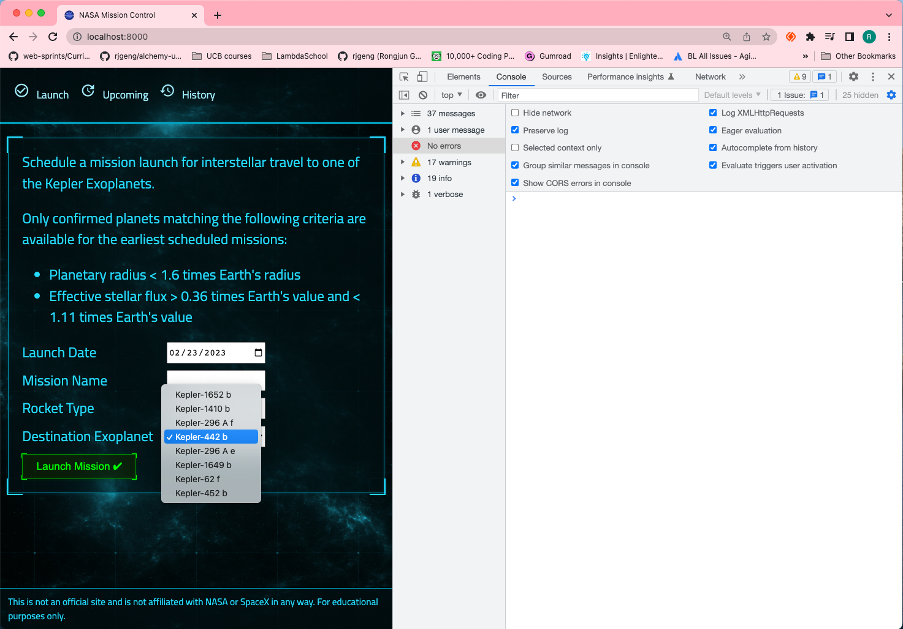

# 116. Serving React.js Front End In Production


-   [Deployment With Create React APP](https://create-react-app.dev/docs/deployment/)

https://github.com/odziem/nasa-project

<details>
  <summary> NASA Project Deployment </summary>

- under **client** `package.json`

```
"build": "BUILD_PATH=../server/public react-scripts build",
```

- under **project root** `package.json`

-   add script `"deploy": "npm run build --prefix client && npm start --prefix server"` in package.json,

-   `server/src/app.js`
```
const path = require('path');
const express = require('express');
const cors = require('cors');

const planetsRouter = require('./routes/planets/planets.router');

const app = express();

app.use(cors({
    origin: 'http://localhost:3000',
}));

app.use(express.json());
app.use(express.static(path.join(__dirname, '..', 'public' )));

app.use(planetsRouter);
app.get('/', (req, res) => {
    res.sendFile(path.join(__dirname, '..', 'public', 'index.html'))
})

module.exports = app;
```

- under project root run `npm run deploy`

```
(base) ➜  9_nasa-project git:(node.js) ✗ npm run deploy

> nasa-project@1.0.0 deploy
> npm run build --prefix client && npm start --prefix server


> nasa-fe@1.0.1 build
> BUILD_PATH=../server/public react-scripts build

Creating an optimized production build...
Browserslist: caniuse-lite is outdated. Please run:
  npx browserslist@latest --update-db
  Why you should do it regularly: https://github.com/browserslist/browserslist#browsers-data-updating
Compiled with warnings.

src/hooks/useLaunches.js
  Line 30:11:  'response' is assigned a value but never used  no-unused-vars
  Line 51:11:  'response' is assigned a value but never used  no-unused-vars

Search for the keywords to learn more about each warning.
To ignore, add // eslint-disable-next-line to the line before.

File sizes after gzip:

  124.48 kB  public/static/js/main.a95694b6.js

The project was built assuming it is hosted at /.
You can control this with the homepage field in your package.json.

The ../server/public folder is ready to be deployed.
You may serve it with a static server:

  npm install -g serve
  serve -s ../server/public

Find out more about deployment here:

  https://cra.link/deployment


> server@1.0.0 start
> node src/server.js

8 habitable planets found!
Listening on port 8000...
```

- goto `http://localhost:8000/`

<p align="center" >
        
</p> 


</details> 

<details>
  <summary> NASA Project Setup </summary>

**client**

-   `client/src/hooks/request.js`
```
const API_URL = 'http://localhost:8000'

// Load planets and return as JSON.
async function httpGetPlanets() {
  const response = await fetch(`${API_URL}/planets`);
  return await response.json();
}

async function httpGetLaunches() {
  // TODO: Once API is ready.
  // Load launches, sort by flight number, and return as JSON.
}

async function httpSubmitLaunch(launch) {
  // TODO: Once API is ready.
  // Submit given launch data to launch system.
}

async function httpAbortLaunch(id) {
  // TODO: Once API is ready.
  // Delete launch with given ID.
}

export {
  httpGetPlanets,
  httpGetLaunches,
  httpSubmitLaunch,
  httpAbortLaunch,
};
```  

**server**

-   `server/src/server.js`
```
const http = require('http');

const app = require('./app');

const { loadPlanetsData } = require('./models/planets.model');

const PORT = process.env.PORT || 8000;

const server = http.createServer(app);

async function startServer() {
    await loadPlanetsData();
    
    server.listen(PORT, () => {
        console.log(`Listening on port ${PORT}...`)
    });
};

startServer();
```

-   `server/src/app.js`
```
const express = require('express');
const cors = require('cors');

const planetsRouter = require('./routes/planets/planets.router');

const app = express();

app.use(cors());
app.use(express.json());
app.use(planetsRouter);

module.exports = app;
```

-   `server/src/routes/planets/planets.controller.js`
```
// const planets = require('../../models/planets.model');
const { planets } = require('../../models/planets.model');

function getAllPlanets(req, res) {
    // res.status(200).json(planets); 
    return res.status(200).json(planets);
};

module.exports = {
    getAllPlanets,
}
```

-   `server/src/routes/planets/planets.router.js`
```
const express = require('express');

const {
    getAllPlanets,
} = require('./planets.controller');

const planetsRouter = express.Router();

planetsRouter.get('/planets', getAllPlanets);

module.exports = planetsRouter;
```

-   `server/src/models/planets.model.js`
```
const  { parse } = require('csv-parse');
const fs = require('fs');
const path = require('path');

const habitablePlanets = [];

function isHabitablePlanet(planet) {
    return planet['koi_disposition'] === 'CONFIRMED'
        && planet['koi_insol'] > 0.36 && planet['koi_insol'] < 1.11
        && planet['koi_prad'] < 1.6;
  }

  /* 
  const promise = new Promise((resolve, reject) => {
    resolve(42);
  });
  promise.then((result) => {

  });
  const result = await promise;
  console.log(result);
  */

function loadPlanetsData(){
    return new Promise((resolve, reject) => {
        fs.createReadStream(path.join(__dirname, '..', '..', 'data', 'kepler_data.csv'))
            .pipe(parse({
                comment: '#',
                columns: true
            }))
            .on('data', (data) => {
                if (isHabitablePlanet(data)){
                    habitablePlanets.push(data);
                }
            })
            .on('error', (err) => {
                console.log(err);
                reject(err);
            })
            .on('end', () => {                
                console.log(`${habitablePlanets.length} habitable planets found!`);
                resolve();
            });
    });
}

module.exports = {
    loadPlanetsData,
    planets: habitablePlanets,
};
```

-  under project root folder run Server `npm run watch`

</details>  

<details>
  <summary> Section 9: NASA Project </summary>

  - [Codebase: nasa-project](../src/s9_nasa-project/)

</details>

---

[Previous](./115_Automating-Full-Stack-Applications-With-NPM.md) | [Next](./117_Setting-BUILD_PATH-On-Windows.md)