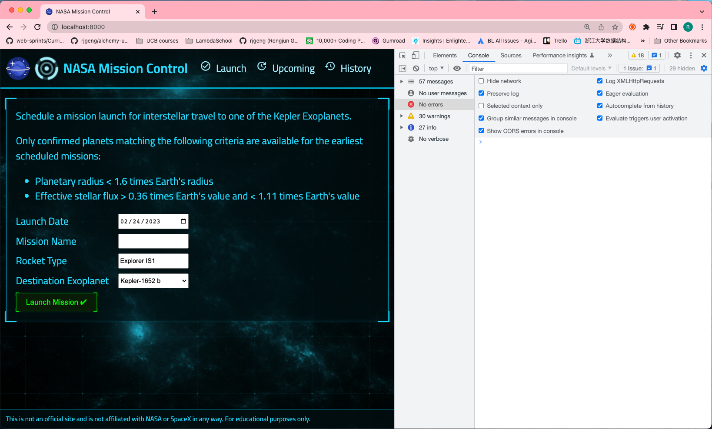

# 118. Logging Requests With Morgan

-   [Morgan Logging Package](https://www.npmjs.com/package/morgan)

https://github.com/odziem/nasa-project

<details>
  <summary> Logging Requests With Morgan </summary>

- install morgan `npm install morgan`

-   `server/src/app.js`
```
const path = require('path');
const express = require('express');
const cors = require('cors');
const morgan = require('morgan');

const planetsRouter = require('./routes/planets/planets.router');

const app = express();

app.use(cors({
    origin: 'http://localhost:3000',
}));
app.use(morgan('combined'));

app.use(express.json());
app.use(express.static(path.join(__dirname, '..', 'public' )));

app.use(planetsRouter);
app.get('/', (req, res) => {
    res.sendFile(path.join(__dirname, '..', 'public', 'index.html'))
})

module.exports = app;
```

- under project root run `npm run watch`

<p align="center" >
        
</p> 

---

- under project root run `npm run deploy`

<p align="center" >
     
</p> 

---
<p align="center" >
        
        
        
</p> 

---

</details>

<details>
  <summary> Section 9: NASA Project </summary>

  - [Codebase: nasa-project](../src/9_nasa-project)

</details>


---

[Previous](./117_Setting-BUILD_PATH-On-Windows.md) | [Next](./119_The-Launches-Model.md)