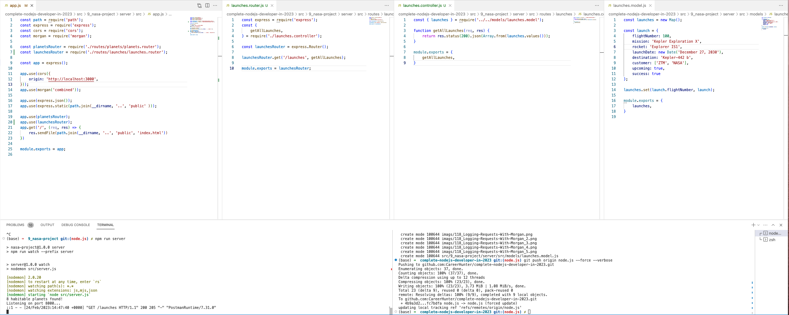
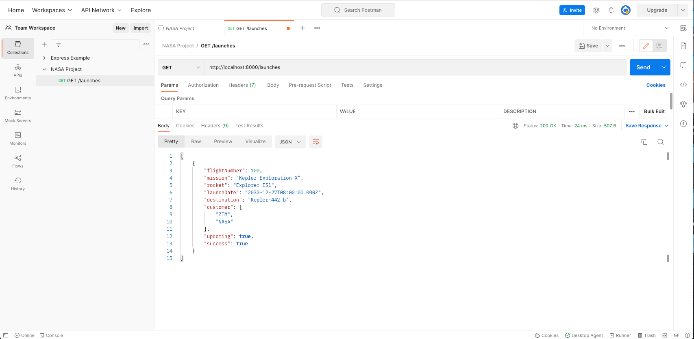
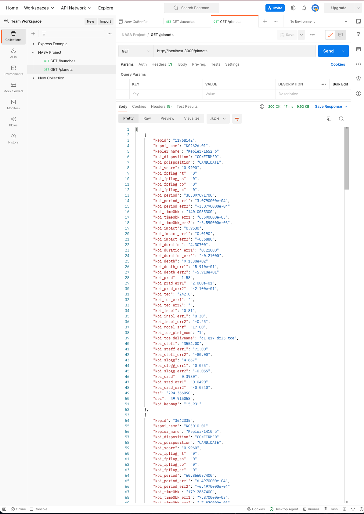
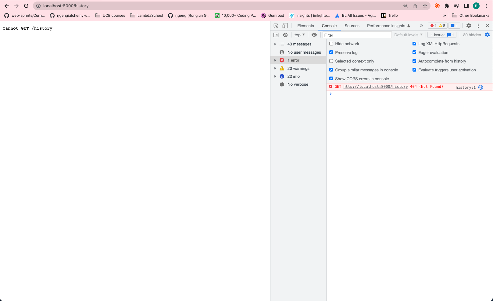

# 120. GET /launches

https://github.com/odziem/nasa-project

<details>
  <summary> 120. GET /launches: server </summary>

-   `server/src/models/launches.model.js` 
```
const launches = new Map();

const launch = {
    flightNumber: 100,
    mission: 'Kepler Exploration X',
    rocket: 'Explorer IS1',
    launchDate: new Date('December 27, 2030'),
    destination: 'Kepler-442 b',
    customer: ['ZTM', 'NASA'],
    upcoming: true,
    success: true
};

launches.set(launch.flightNumber, launch);

module.exports = {
    launches,
}
```

-   `server/src/app.js`
```
const path = require('path');
const express = require('express');
const cors = require('cors');
const morgan = require('morgan');

const planetsRouter = require('./routes/planets/planets.router');
const launchesRouter = require('./routes/launches/launches.router');

const app = express();

app.use(cors({
    origin: 'http://localhost:3000',
}));
app.use(morgan('combined'));

app.use(express.json());
app.use(express.static(path.join(__dirname, '..', 'public' )));

app.use(planetsRouter);
app.use(launchesRouter);
app.get('/', (req, res) => {
    res.sendFile(path.join(__dirname, '..', 'public', 'index.html'))
})

module.exports = app;
```

-   `server/src/routes/launches/launches.router.js`
```
const express = require('express');
const {
    getAllLaunches,
} = require('./launches.controller');

const launchesRouter = express.Router();

launchesRouter.get('/launches', getAllLaunches);

module.exports = launchesRouter;
```

-   `server/src/routes/launches/launches.controller.js`
```
const { launches } = require('../../models/launches.model');

function getAllLaunches(req, res) {
    return res.status(200).json(Array.from(launches.values()));
}

module.exports = {
    getAllLaunches,
}
```

- under project root run `npm run server`

<p align="center" >
     
</p> 

- goto postman `GET http://localhost:8000/launches`

<p align="center" >
     
</p> 

- goto postman `GET http://localhost:8000/planets`

<p align="center" >
     
</p> 

</details>

<details>
  <summary> 120. GET /launches: client </summary>

-   `client/src/hooks/request.js`
```
const API_URL = 'http://localhost:8000'

// Load planets and return as JSON.
async function httpGetPlanets() {
  const response = await fetch(`${API_URL}/planets`);
  return await response.json();
}

// Load launches, sort by flight number, and return as JSON.
async function httpGetLaunches() {
  const response = await fetch(`${API_URL}/launches`);
  const fetchedLaunches = await response.json(); 
  return fetchedLaunches.sort((a,b) => {
    return a.flightNumber - b.flightNumber;
  });
}

async function httpSubmitLaunch(launch) {
  // TODO: Once API is ready.
  // Submit given launch data to launch system.
}

async function httpAbortLaunch(id) {
  // TODO: Once API is ready.
  // Delete launch with given ID.
}

export {
  httpGetPlanets,
  httpGetLaunches,
  httpSubmitLaunch,
  httpAbortLaunch,
};
```

- under project root run `npm run deploy`

- goto `http://localhost:8000/`

<p align="center" >
     
</p> 

</details>

<details>
  <summary> Section 9: NASA Project </summary>

  - [Codebase: nasa-project](../src/s9_nasa-project/)

</details>

---

[Previous](./119_The-Launches-Model.md) | [Next](./121_Serving-Applications-With-Client-Side-Routing.md)