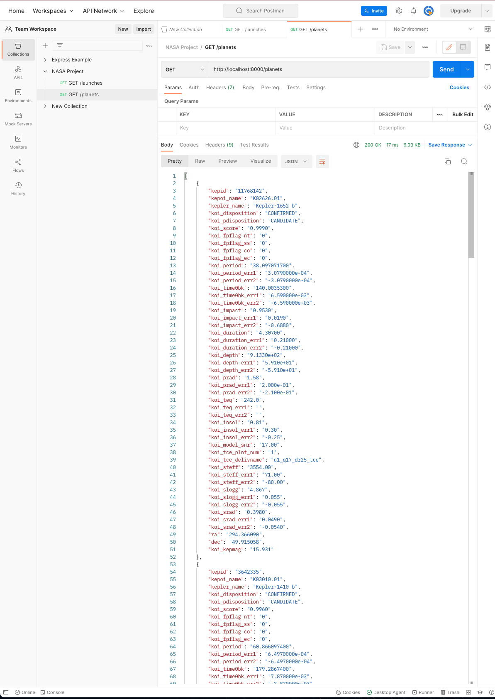

# 122. Working With Data Models: Building a Data Access Layer

-   [Separation Of Concern](https://en.wikipedia.org/wiki/Separation_of_concerns)

-   [Separation of Concerns in Software Design](https://nalexn.github.io/separation-of-concerns/)

-   [Bonus: Example of Layered Architecture to Design iOS Apps](https://www.vadimbulavin.com/layered-architecture-ios/)

https://github.com/odziem/nasa-project

<details>
  <summary> 120. GET /launches: Data Access Layer </summary>

-   `server/src/models/launches.model.js` 
```
const launches = new Map();

const launch = {
    flightNumber: 100,
    mission: 'Kepler Exploration X',
    rocket: 'Explorer IS1',
    launchDate: new Date('December 27, 2030'),
    destination: 'Kepler-442 b',
    customer: ['ZTM', 'NASA'],
    upcoming: true,
    success: true
};

launches.set(launch.flightNumber, launch);

function getAllLaunches () {
    return Array.from(launches.values());
}

module.exports = {
    getAllLaunches,
}

```

-   `server/src/routes/launches/launches.controller.js`
```
const { getAllLaunches } = require('../../models/launches.model');

function httpGetAllLaunches(req, res) {
    return res.status(200).json(getAllLaunches());
}

module.exports = {
    httpGetAllLaunches,
}
```

-   `server/src/routes/launches/launches.router.js`
```
const express = require('express');
const {
    httpGetAllLaunches,
} = require('./launches.controller');

const launchesRouter = express.Router();

launchesRouter.get('/launches', httpGetAllLaunches);

module.exports = launchesRouter;
```
</details>

<details>
  <summary> 120. GET /planets: Data Access Layer </summary>

-   `server/src/models/planets.model.js` 
```
const  { parse } = require('csv-parse');
const fs = require('fs');
const path = require('path');

const habitablePlanets = [];

function isHabitablePlanet(planet) {
    return planet['koi_disposition'] === 'CONFIRMED'
        && planet['koi_insol'] > 0.36 && planet['koi_insol'] < 1.11
        && planet['koi_prad'] < 1.6;
  }

  
function loadPlanetsData(){
    return new Promise((resolve, reject) => {
        fs.createReadStream(path.join(__dirname, '..', '..', 'data', 'kepler_data.csv'))
            .pipe(parse({
                comment: '#',
                columns: true
            }))
            .on('data', (data) => {
                if (isHabitablePlanet(data)){
                    habitablePlanets.push(data);
                }
            })
            .on('error', (err) => {
                console.log(err);
                reject(err);
            })
            .on('end', () => {                
                console.log(`${habitablePlanets.length} habitable planets found!`);
                resolve();
            });
    });
}

function getAllPlanets () {
    return habitablePlanets;
};

module.exports = {
    loadPlanetsData,
    getAllPlanets,
};
```

-   `server/src/routes/planets/planets.controller.js`
```
const { getAllPlanets } = require('../../models/planets.model')

function httpGetAllPlanets(req, res) {
    // res.status(200).json(planets); 
    return res.status(200).json(getAllPlanets);
};

module.exports = {
    httpGetAllPlanets,
}
```

-   `server/src/routes/planets/planets.router.js`
```
const express = require('express');

const {
    httpGetAllPlanets,
} = require('./planets.controller');

const planetsRouter = express.Router();

planetsRouter.get('/planets', httpGetAllPlanets);

module.exports = planetsRouter;
```
</details>


<details>
  <summary> Project deployment result - capture </summary>

- under project root run `npm run deploy` 

- goto `http://localhost:8000/hsitory` 

<p align="center" >
     
</p> 

---

- goto postman `GET http://localhost:8000/launches`

<p align="center" >
     
</p> 

- goto postman `GET http://localhost:8000/planets`

<p align="center" >
     
</p> 

</details>

<details>
  <summary> Section 9: NASA Project </summary>

  - [Codebase: nasa-project](../src/9_nasa-project)

</details>


---

[Previous](./121_Serving-Applications-With-Client-Side-Routing.md) | [Next](./123_POST_launches_Creating-Launches-1.md)