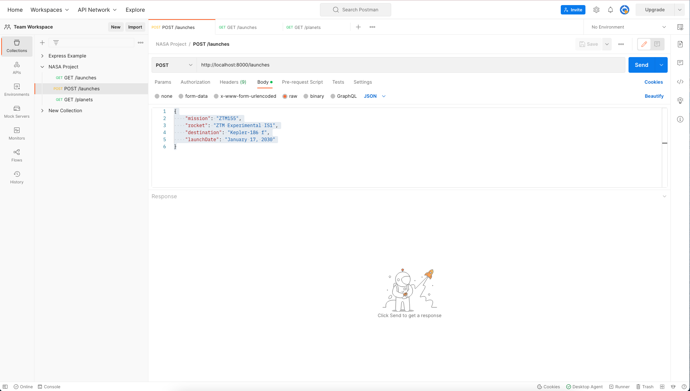
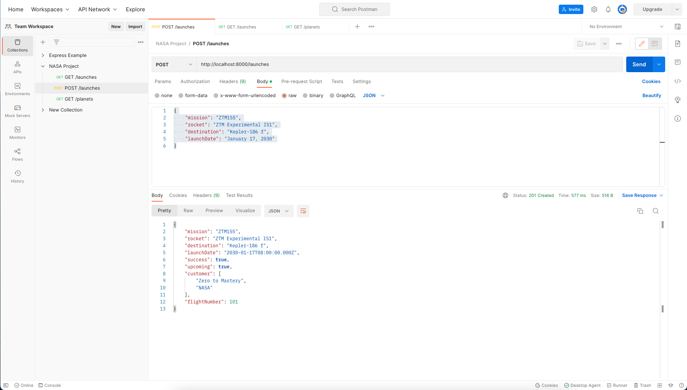
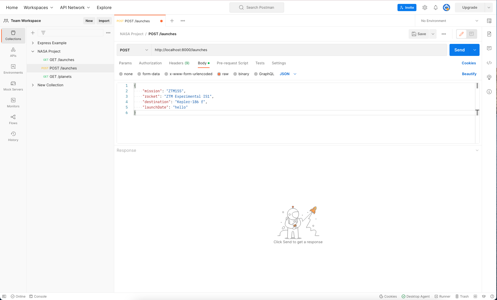
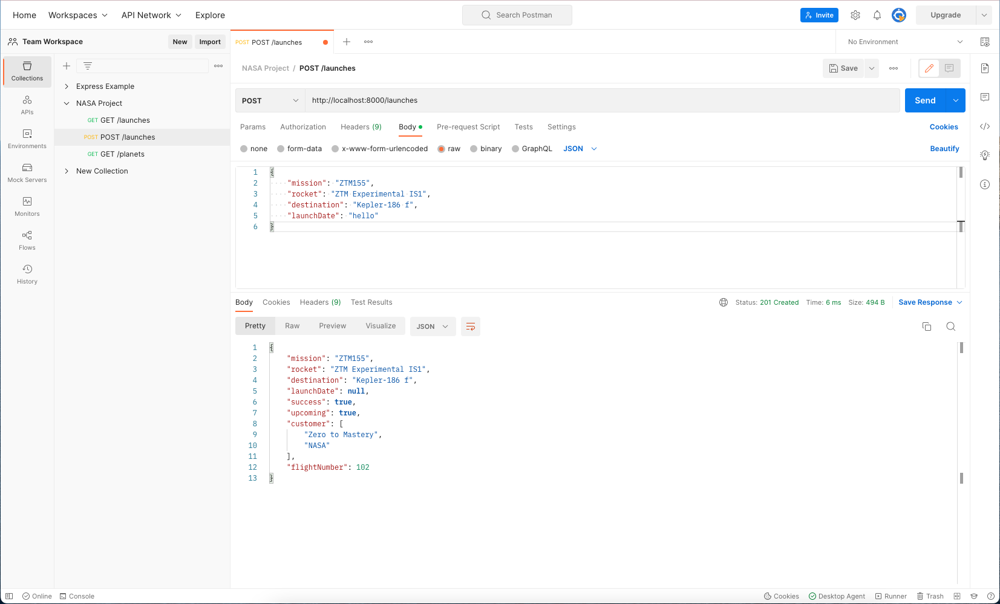

# 124. POST /launches: Creating Launches 2


https://github.com/odziem/nasa-project


<details>
  <summary> 124. POST /launches: Creating Launches 2 </summary>

-   `server/src/models/launches.model.js` 
```
const launches = new Map();

let latestFlightNumber = 100;

const launch = {
    flightNumber: 100,
    mission: 'Kepler Exploration X',
    rocket: 'Explorer IS1',
    launchDate: new Date('December 27, 2030'),
    destination: 'Kepler-442 b',
    customer: ['ZTM', 'NASA'],
    upcoming: true,
    success: true
};

launches.set(launch.flightNumber, launch);

function getAllLaunches () {
    return Array.from(launches.values());
}

function addNewLaunch(launch) {
    latestFlightNumber++;
    launches.set(
        latestFlightNumber, 
        Object.assign(launch, {
            success: true,
            upcoming: true,
            customer: ['Zero to Mastery', 'NASA'],
            flightNumber: latestFlightNumber,

    }));
}

module.exports = {
    getAllLaunches,
    addNewLaunch,
}
```

-   `server/src/routes/launches/launches.controller.js`
```
const { 
    getAllLaunches, 
    addNewLaunch, 
} = require('../../models/launches.model');

function httpGetAllLaunches(req, res) {
    return res.status(200).json(getAllLaunches());
}

function httpAddNewLaunch (req, res) {
    const launch = req.body;

    launch.launchDate = new Date(launch.launchDate);

    addNewLaunch(launch);
    return res.status(201).json(launch);
}

module.exports = {
    httpGetAllLaunches,
    httpAddNewLaunch,
}
```

-   `server/src/routes/launches/launches.router.js`
```
const express = require('express');
const {
    httpGetAllLaunches,
    httpAddNewLaunch,
} = require('./launches.controller');

const launchesRouter = express.Router();

launchesRouter.get('/', httpGetAllLaunches);
launchesRouter.post('/', httpAddNewLaunch);

module.exports = launchesRouter;
```

-   `server/src/routes/planets/planets.router.js`
```
const express = require('express');

const {
    httpGetAllPlanets,
} = require('./planets.controller');

const planetsRouter = express.Router();

planetsRouter.get('/', httpGetAllPlanets);

module.exports = planetsRouter;
```

-   `server/src/app.js`
```
const path = require('path');
const express = require('express');
const cors = require('cors');
const morgan = require('morgan');

const planetsRouter = require('./routes/planets/planets.router');
const launchesRouter = require('./routes/launches/launches.router');

const app = express();

app.use(cors({
    origin: 'http://localhost:3000',
}));
app.use(morgan('combined'));

app.use(express.json());
app.use(express.static(path.join(__dirname, '..', 'public' )));

app.use('/planets', planetsRouter);
app.use('/launches', launchesRouter);
app.get('/*', (req, res) => {
    res.sendFile(path.join(__dirname, '..', 'public', 'index.html'))
})

module.exports = app;
```

- goto postman `GET http://localhost:8000/launches`

<p align="center" >
     
</p> 

- goto postman `GET http://localhost:8000/planets`

<p align="center" >
     
</p> 

- postman `Post http://localhost:8000/launches`
    -   Body --> raw --> JSON
```
{
    "mission": "ZTM155",
    "rocket": "ZTM Experimental IS1",
    "destination": "Kepler-186 f",
    "launchDate": "January 17, 2030"
}
```

<p align="center" >
     
     
</p> 

**issues** with `launchDate` 

- postman `Post http://localhost:8000/launches`
    -   Body --> raw --> JSON
```
{
    "mission": "ZTM155",
    "rocket": "ZTM Experimental IS1",
    "destination": "Kepler-186 f",
    "launchDate": "hello"
}
```

<p align="center" >
     
     
</p> 


</details>  

<<details>
  <summary> Section 9: NASA Project </summary>

  - [Codebase: nasa-project](../src/s9_nasa-project/)

</details>

---

[Previous](./123_POST_launches_Creating-Launches-1.md) | [Next](./125_POST_launches_Validation-For-POST-Requests.md)