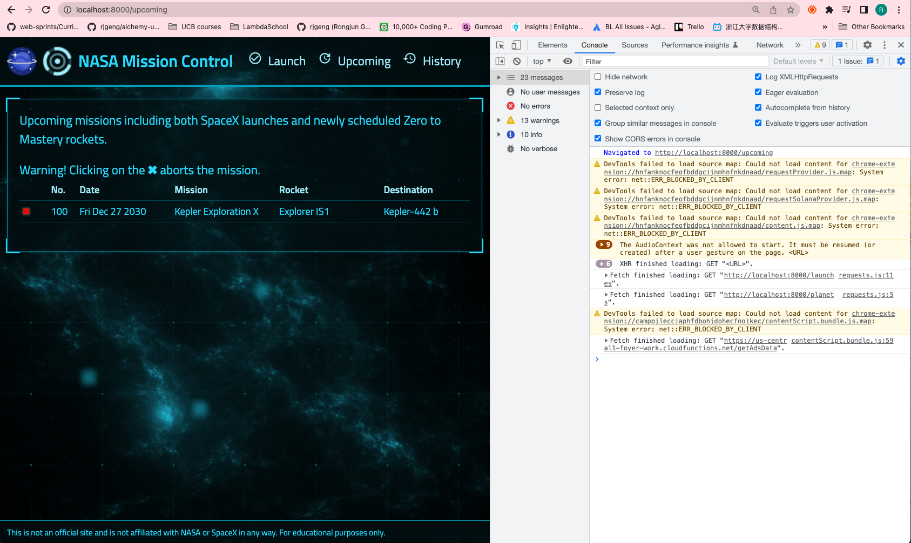
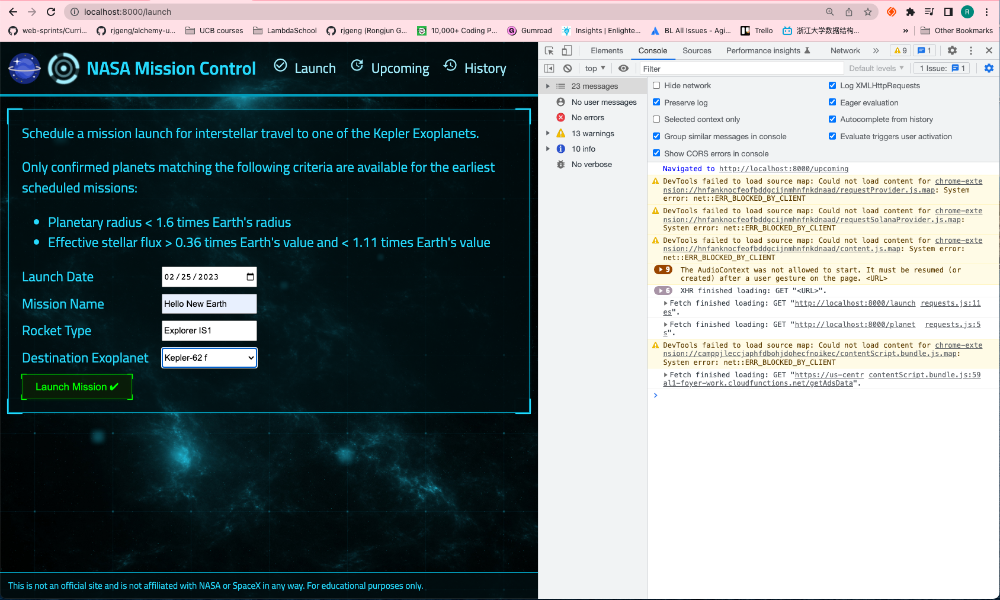

# 126. Connecting POST /launches With Front End Dashboard

https://github.com/odziem/nasa-project

-   `client/src/hooks/request.js`
```
const API_URL = 'http://localhost:8000'

// Load planets and return as JSON.
async function httpGetPlanets() {
  const response = await fetch(`${API_URL}/planets`);
  return await response.json();
}

// Load launches, sort by flight number, and return as JSON.
async function httpGetLaunches() {
  const response = await fetch(`${API_URL}/launches`);
  const fetchedLaunches = await response.json();
  return fetchedLaunches.sort((a, b) => {
    return a.flightNumber - b.flightNumber;
  });
}

// Submit given launch data to launch system.
async function httpSubmitLaunch(launch) {
  try {
    return await fetch(`${API_URL}/launches`, {
      method: "post",
      headers: {
        "Content-Type": "application/json",
      },
      body: JSON.stringify(launch),
    });
  } catch(err) {
    return {
      ok: false,
    };
  }
}

async function httpAbortLaunch(id) {
  // TODO: Once API is ready.
  // Delete launch with given ID.
}

export {
  httpGetPlanets,
  httpGetLaunches,
  httpSubmitLaunch,
  httpAbortLaunch,
};
```  

<details>
  <summary> 126. Connecting POST /launches With Front End Dashboard </summary>

**client**

-   `client/src/hooks/request.js`
```
const API_URL = 'http://localhost:8000'

// Load planets and return as JSON.
async function httpGetPlanets() {
  const response = await fetch(`${API_URL}/planets`);
  return await response.json();
}

// Load launches, sort by flight number, and return as JSON.
async function httpGetLaunches() {
  const response = await fetch(`${API_URL}/launches`);
  const fetchedLaunches = await response.json();
  return fetchedLaunches.sort((a, b) => {
    return a.flightNumber - b.flightNumber;
  });
}

// Submit given launch data to launch system.
async function httpSubmitLaunch(launch) {
  try {
    return await fetch(`${API_URL}/launches`, {
      method: "post",
      headers: {
        "Content-Type": "application/json",
      },
      body: JSON.stringify(launch),
    });
  } catch(err) {
    return {
      ok: false,
    };
  }
}

async function httpAbortLaunch(id) {
  // TODO: Once API is ready.
  // Delete launch with given ID.
}

export {
  httpGetPlanets,
  httpGetLaunches,
  httpSubmitLaunch,
  httpAbortLaunch,
};
```  

-   `client/src/hooks/useLaunches.js`
```
// ...

setPendingLaunch(true);

//  ...

const success = response.ok;

//  ...

```  

**server**

-   `server/src/models/launches.model.js` 
```
const launches = new Map();

let latestFlightNumber = 100;

const launch = {
    flightNumber: 100,
    mission: 'Kepler Exploration X',
    rocket: 'Explorer IS1',
    launchDate: new Date('December 27, 2030'),
    destination: 'Kepler-442 b',
    customer: ['ZTM', 'NASA'],
    upcoming: true,
    success: true
};

launches.set(launch.flightNumber, launch);

function getAllLaunches () {
    return Array.from(launches.values());
}

function addNewLaunch(launch) {
    latestFlightNumber++;
    launches.set(
        latestFlightNumber, 
        Object.assign(launch, {
            success: true,
            upcoming: true,
            customer: ['Zero to Mastery', 'NASA'],
            flightNumber: latestFlightNumber,

    }));
}

module.exports = {
    getAllLaunches,
    addNewLaunch,
}
```

-   `server/src/routes/launches/launches.controller.js`
```
const { 
    getAllLaunches, 
    addNewLaunch, 
} = require('../../models/launches.model');

function httpGetAllLaunches(req, res) {
    return res.status(200).json(getAllLaunches());
}

function httpAddNewLaunch (req, res) {
    const launch = req.body;

    if ( !launch.mission || !launch.roket || !launch.launchDate 
        || launch.target ) {
            return res.status(400).json({
                error: 'Missing required launch property'
            });    
        };

    launch.launchDate = new Date(launch.launchDate);
    if (isNaN(launch.launchDate.toString)){
        return res.status(400).json({
            error: 'Invalid launch Date',
        });   
    };

    addNewLaunch(launch);
    return res.status(201).json(launch);
}

module.exports = {
    httpGetAllLaunches,
    httpAddNewLaunch,
}
```

-   `server/src/routes/launches/launches.router.js`
```
const express = require('express');
const {
    httpGetAllLaunches,
    httpAddNewLaunch,
} = require('./launches.controller');

const launchesRouter = express.Router();

launchesRouter.get('/', httpGetAllLaunches);
launchesRouter.post('/', httpAddNewLaunch);

module.exports = launchesRouter;
```

-   `server/src/routes/planets/planets.router.js`
```
const express = require('express');

const {
    httpGetAllPlanets,
} = require('./planets.controller');

const planetsRouter = express.Router();

planetsRouter.get('/', httpGetAllPlanets);

module.exports = planetsRouter;
```

-   `server/src/app.js`
```
const path = require('path');
const express = require('express');
const cors = require('cors');
const morgan = require('morgan');

const planetsRouter = require('./routes/planets/planets.router');
const launchesRouter = require('./routes/launches/launches.router');

const app = express();

app.use(cors({
    origin: 'http://localhost:3000',
}));
app.use(morgan('combined'));

app.use(express.json());
app.use(express.static(path.join(__dirname, '..', 'public' )));

app.use('/planets', planetsRouter);
app.use('/launches', launchesRouter);
app.get('/*', (req, res) => {
    res.sendFile(path.join(__dirname, '..', 'public', 'index.html'))
})

module.exports = app;
```
</details>

<details>
  <summary> result - capture </summary>

-   goto `http://localhost:8000` --> `http://localhost:8000/upcoming` --> `http://localhost:8000/launch` --> `http://localhost:8000/upcoming`

<p align="center" >
     
     
     
</p> 

</details>  

<details>
  <summary> Section 9: NASA Project </summary>

  - [Codebase: nasa-project](../src/9_nasa-project)

</details>


---

[Previous](./125_POST_launches_Validation-For-POST-Requests.md) | [Next]()