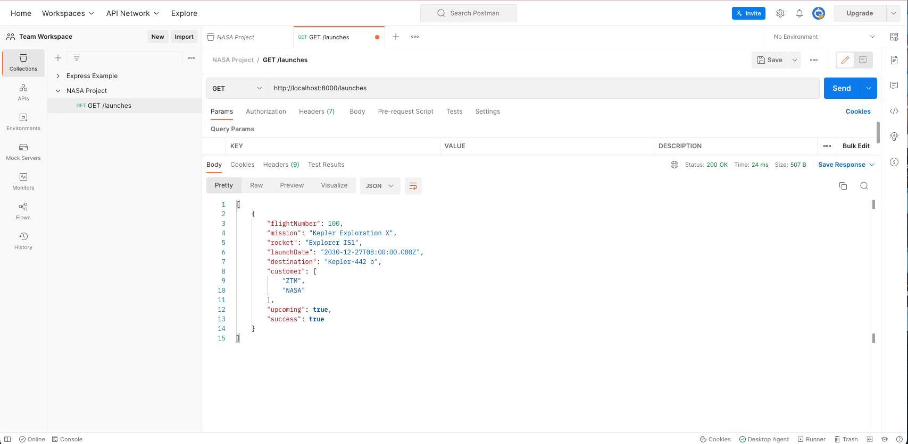

# 128. DELETE /launches: Aborting Launches 2

https://github.com/odziem/nasa-project

<details>
  <summary> 128. DELETE /launches: Aborting Launches 2 </summary>

**client**

-   `client/src/hooks/request.js`
```
const API_URL = 'http://localhost:8000'

// Load planets and return as JSON.
async function httpGetPlanets() {
  const response = await fetch(`${API_URL}/planets`);
  return await response.json();
}

// Load launches, sort by flight number, and return as JSON.
async function httpGetLaunches() {
  const response = await fetch(`${API_URL}/launches`);
  const fetchedLaunches = await response.json();
  return fetchedLaunches.sort((a, b) => {
    return a.flightNumber - b.flightNumber;
  });
}

// Submit given launch data to launch system.
async function httpSubmitLaunch(launch) {
  try {
    return await fetch(`${API_URL}/launches`, {
      method: "post",
      headers: {
        "Content-Type": "application/json",
      },
      body: JSON.stringify(launch),
    });
  } catch(err) {
    return {
      ok: false,
    };
  }
}

// Delete launch with given ID.
async function httpAbortLaunch(id) {
  try {
    return await fetch(`${API_URL}/launches/${id}`, {
      method: "delete",
    });    
  } catch (err){
    console.log(err);
    return {
      ok: false,
    }
  }
}

export {
  httpGetPlanets,
  httpGetLaunches,
  httpSubmitLaunch,
  httpAbortLaunch,
};
```  

-   `client/src/hooks/useLaunches.js`
```
import { useCallback, useEffect, useState } from "react";

import {
  httpGetLaunches,
  httpSubmitLaunch,
  httpAbortLaunch,
} from './requests';

function useLaunches(onSuccessSound, onAbortSound, onFailureSound) {
  const [launches, saveLaunches] = useState([]);
  const [isPendingLaunch, setPendingLaunch] = useState(false);

  const getLaunches = useCallback(async () => {
    const fetchedLaunches = await httpGetLaunches();
    saveLaunches(fetchedLaunches);
  }, []);

  useEffect(() => {
    getLaunches();
  }, [getLaunches]);

  const submitLaunch = useCallback(async (e) => {
    e.preventDefault();
    setPendingLaunch(true);
    const data = new FormData(e.target);
    const launchDate = new Date(data.get("launch-day"));
    const mission = data.get("mission-name");
    const rocket = data.get("rocket-name");
    const target = data.get("planets-selector");
    const response = await httpSubmitLaunch({
      launchDate,
      mission,
      rocket,
      target,
    });

    const success = response.ok;
    if (success) {
      getLaunches();
      setTimeout(() => {
        setPendingLaunch(false);
        onSuccessSound();
      }, 800);
    } else {
      onFailureSound();
    }
  }, [getLaunches, onSuccessSound, onFailureSound]);

  const abortLaunch = useCallback(async (id) => {
    const response = await httpAbortLaunch(id);

    // TODO: Set success based on response.
    const success = response.ok;
    if (success) {
      getLaunches();
      onAbortSound();
    } else {
      onFailureSound();
    }
  }, [getLaunches, onAbortSound, onFailureSound]);

  return {
    launches,
    isPendingLaunch,
    submitLaunch,
    abortLaunch,
  };
}

export default useLaunches;
```  

**server**

-   `server/src/models/launches.model.js` 
```
const launches = new Map();

let latestFlightNumber = 100;

const launch = {
    flightNumber: 100,
    mission: 'Kepler Exploration X',
    rocket: 'Explorer IS1',
    launchDate: new Date('December 27, 2030'),
    target: 'Kepler-442 b',
    customer: ['ZTM', 'NASA'],
    upcoming: true,
    success: true
};

launches.set(launch.flightNumber, launch);

function existsLaunchWithId(launchId){
    return launches.has(launchId)
}

function getAllLaunches () {
    return Array.from(launches.values());
}

function addNewLaunch(launch) {
    latestFlightNumber++;
    launches.set(
        latestFlightNumber, 
        Object.assign(launch, {
            success: true,
            upcoming: true,
            customer: ['Zero to Mastery', 'NASA'],
            flightNumber: latestFlightNumber,
        })
    );
}

function abortLaunchById (launchId) {
    const aborted = launches.get(launchId);
    aborted.upcoming = false;
    aborted.sucess = false;
    return aborted;    
}

module.exports = {
    existsLaunchWithId,
    getAllLaunches,
    addNewLaunch,
    abortLaunchById,
}

```

-   `server/src/routes/launches/launches.controller.js`
```
const { 
    getAllLaunches, 
    addNewLaunch, 
    existsLaunchWithId,
    abortLaunchById,
} = require('../../models/launches.model');

function httpGetAllLaunches(req, res) {
    return res.status(200).json(getAllLaunches());
}

function httpAddNewLaunch (req, res) {
    const launch = req.body;

    if (!launch.mission || !launch.rocket || !launch.launchDate
      || !launch.target) {
        return res.status(400).json({
          error: 'Missing required launch property',
        });
      }
  
    launch.launchDate = new Date(launch.launchDate);
    if (isNaN(launch.launchDate)) {
      return res.status(400).json({
        error: 'Invalid launch date',
      });
    }

    addNewLaunch(launch);
    return res.status(201).json(launch);
}

function httpAbortLaunch (req, res) {
  const launchId = Number(req.params.id);

  if (!existsLaunchWithId(launchId)){
    return res.status(404).json({
      error: 'Lauch not found',
    });
  }

  const aborted = abortLaunchById(launchId);
  return res.status(200).json(aborted);
}

module.exports = {
    httpGetAllLaunches,
    httpAddNewLaunch,
    httpAbortLaunch,
}
```

-   `server/src/routes/launches/launches.router.js`
```
const express = require('express');
const {
    httpGetAllLaunches,
    httpAddNewLaunch,
    httpAbortLaunch,
} = require('./launches.controller');

const launchesRouter = express.Router();

launchesRouter.get('/', httpGetAllLaunches);
launchesRouter.post('/', httpAddNewLaunch);
launchesRouter.delete('/:id', httpAbortLaunch);

module.exports = launchesRouter;
```

**following unchanged **

-   `server/src/routes/planets/planets.router.js`
```
const express = require('express');

const {
    httpGetAllPlanets,
} = require('./planets.controller');

const planetsRouter = express.Router();

planetsRouter.get('/', httpGetAllPlanets);

module.exports = planetsRouter;
```

-   `server/src/app.js`
```
const path = require('path');
const express = require('express');
const cors = require('cors');
const morgan = require('morgan');

const planetsRouter = require('./routes/planets/planets.router');
const launchesRouter = require('./routes/launches/launches.router');

const app = express();

app.use(cors({
    origin: 'http://localhost:3000',
}));
app.use(morgan('combined'));

app.use(express.json());
app.use(express.static(path.join(__dirname, '..', 'public' )));

app.use('/planets', planetsRouter);
app.use('/launches', launchesRouter);
app.get('/*', (req, res) => {
    res.sendFile(path.join(__dirname, '..', 'public', 'index.html'))
})

module.exports = app;
```
</details>

<details>
  <summary> result - capture </summary>

- `run npm run deply`

- goto postman `GET http://localhost:8000/launches`

<p align="center" >
     
</p> 

- postman `Post http://localhost:8000/launches`
    -   Body --> raw --> JSON
```
{
    "mission": "ZTM155",
    "rocket": "ZTM Experimental IS1",
    "target": "Kepler-186 f",
    "launchDate": "July 1, 2028"
}
```
- goto postman `GET http://localhost:8000/launches`

<p align="center" >
     
     
</p> 

- goto postman `DELETE http://localhost:8000/launches/100` then `GET http://localhost:8000/launches`

<p align="center" >
     
     
</p> 

- goto postman `DELETE http://localhost:8000/launches/188` 

<p align="center" >
     

- goto `http://localhost:8000/upcoming` click `x` to remove the launch
- then goto `http://localhost:8000/launch` add new launch then check `http://localhost:8000/upcoming`

<p align="center" >
     
     
     
     
</p> 

- goto `http://localhost:8000/history` 

<p align="center" >
     

</p> 

</details>  

<details>
  <summary> Section 9: NASA Project </summary>

  - [Codebase: nasa-project](../src/9_nasa-project)

</details>


---

[Previous](./127_DELETE_launches_Aborting-Launches-1.md) | [Next](./129_Updating-Our-Architecture-Diagram.md)