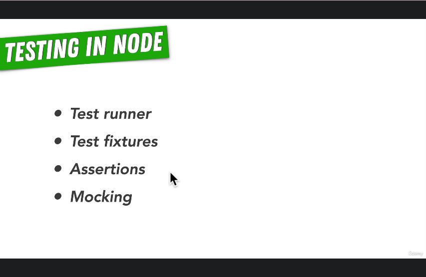
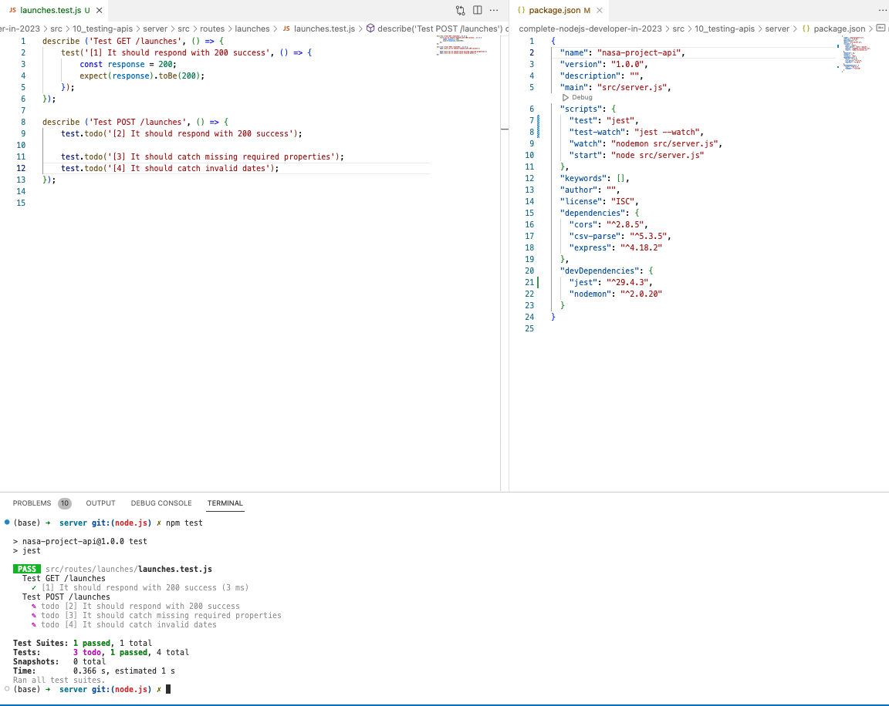

# 132. Testing APIs With Jest

-   [Official jest Website](https://jestjs.io/)

<p align="center" >
     
</p> 

https://github.com/odziem/nasa-project

-   `server/src/routes/launches/launches.test.js`

```
describe ('Test GET /launches', () => {
    test('[1] It should respond with 200 success', () => {
        const response = 200;
        expect(response).toBe(200);    
    });
});

describe ('Test POST /launches', () => {
    test.todo('[2] It should respond with 200 success');
    
    test.todo('[3] It should catch missing required properties');
    test.todo('[4] It should catch invalid dates');
});
```

<details>
  <summary> Testing APIs - result capture </summary>

- run test `npm test`  

<p align="center" >
     
</p> 

</details>

<details>
  <summary> Section 10: Testing APIs </summary>

  - [Codebase: testing-apis](../src/10_testing-apis/)

</details>

---

[Previous](./131_Testing-In-Node.md) | [Next](./133_Testing-API-Endpoints-With-Supertest_GET.md)