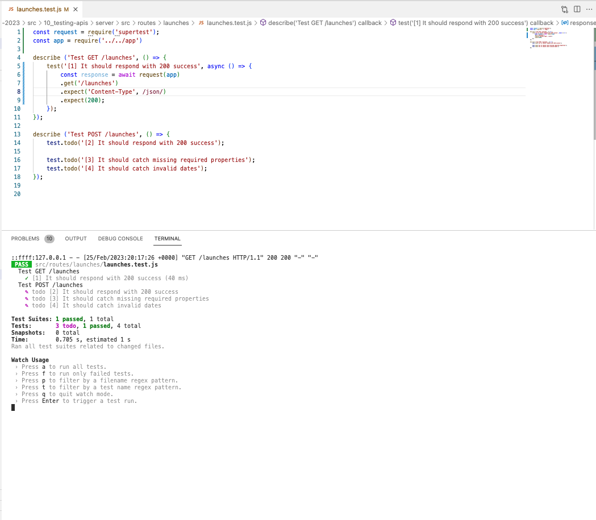

# 133. Testing API Endpoints With Supertest: GET

-   [Supertest NPM Package](https://www.npmjs.com/package/supertest)


https://github.com/odziem/nasa-project

-   `server/src/routes/launches/launches.test.js`

```
const request = require('supertest');
const app = require('../../app')

describe ('Test GET /launches', () => {
    test('[1] It should respond with 200 success', async () => {
        const response = await request(app)
        .get('/launches')
        .expect('Content-Type', /json/)
        .expect(200);
    });
});

describe ('Test POST /launches', () => {
    test.todo('[2] It should respond with 200 success');
    
    test.todo('[3] It should catch missing required properties');
    test.todo('[4] It should catch invalid dates');
});
```

<details>
  <summary> Testing APIs - result capture </summary>

- run test `npm test-watch`  

<p align="center" >
     
</p> 

</details>

<details>
  <summary> Section 10: Testing APIs </summary>

  - [Codebase: testing-apis](../src/s10_testing-apis/)

</details>

---

[Previous](./132_Testing-APIs-With-Jest.md) | [Next](./134_Testing-API-Endpoints-With-Supertes_POST.md)