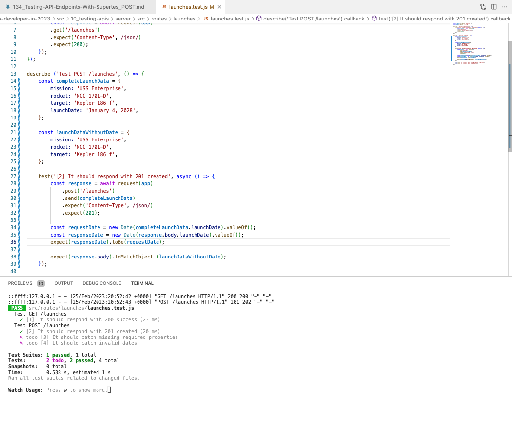

# 134. Testing API Endpoints With Supertest: POST


https://github.com/odziem/nasa-project

-   `server/src/routes/launches/launches.test.js`

```
const request = require('supertest');
const app = require('../../app')

describe ('Test GET /launches', () => {
    test('[1] It should respond with 200 success', async () => {
        const response = await request(app)
        .get('/launches')
        .expect('Content-Type', /json/)
        .expect(200);
    });
});

describe ('Test POST /launches', () => {
    const completeLaunchData = {
        mission: 'USS Enterprise',
        rocket: 'NCC 1701-D',
        target: 'Kepler 186 f',
        launchDate: 'January 4, 2028',
    };

    const launchDataWithoutDate = {
        mission: 'USS Enterprise',
        rocket: 'NCC 1701-D',
        target: 'Kepler 186 f',  
    };

    test('[2] It should respond with 201 created', async () => {
        const response = await request(app)
            .post('/launches')
            .send(completeLaunchData)
            .expect('Content-Type', /json/)
            .expect(201);

        const requestDate = new Date(completeLaunchData.launchDate).valueOf();
        const responseDate = new Date(response.body.launchDate).valueOf();
        expect(responseDate).toBe(requestDate);

        expect(response.body).toMatchObject (launchDataWithoutDate);
    });
    
    test.todo('[3] It should catch missing required properties');
    test.todo('[4] It should catch invalid dates');
});

```

<details>
  <summary> Testing APIs - result capture </summary>

- run test `npm test-watch`  

<p align="center" >
     
</p> 

</details>

<details>
  <summary> Section 10: Testing APIs </summary>

  - [Codebase: testing-apis](../src/10_testing-apis/)

</details>

---

[Previous](./133_Testing-API-Endpoints-With-Supertest_GET.md) | [Next](./135_Testing-API-Endpoints-With-Supertest_Error-Cases.md)