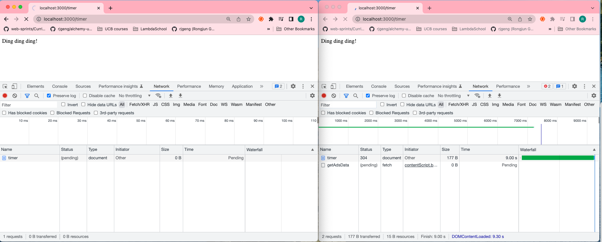
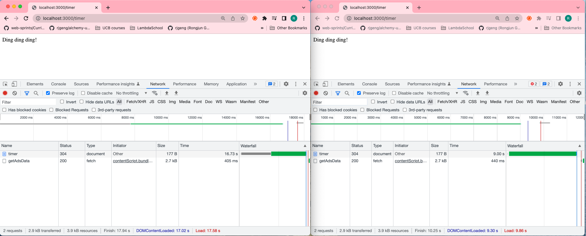

# 138. Building A Simple Blocking Server

-   [Lesson Code](https://github.com/odziem/performance-example/tree/7c991e73be885e41da666d0bfc11eb8af2cdddb3)

https://github.com/odziem/performance-example

- `server.js`
```
const express = require('express');

const app = express();

function delay (duration){
    const startTime = Date.now();
    while(Date.now() - startTime < duration) {
        // event loop is blocked....
    }
}

app.get('/', (req, res) => {
    res.send('Performance Example');
});

app.get('/timer', (req, res) => {
    delay(9000);
    res.send('Ding ding ding!');
});

app.listen(3000);
```

<details>
  <summary> result - capture </summary>

<p align="center" >
     
     
</p> 

</details>  

<details>
  <summary> Section 11: Improving Node Performance </summary>

  - [Codebase: performance-example](../src/11_performance-example/)

</details>

---

[Previous](./137_Node-Server-Performance.md) | [Next](./139_Real-Life-Blocking-Functions.md)