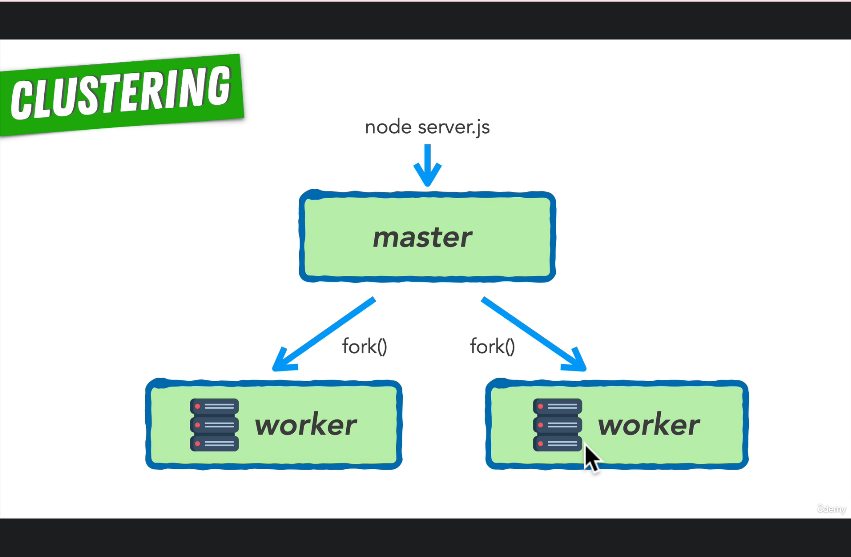

# 142. Clustering In Action

<p align="center" >
     
</p> 

https://github.com/odziem/performance-example

- server.js
```
const express = require('express');
const cluster = require('cluster');
const { cpSync } = require('fs');

const app = express();

function delay (duration){
    const startTime = Date.now();
    while(Date.now() - startTime < duration) {
        // event loop is blocked....
    }
}

app.get('/', (req, res) => {
    // JSON.stringify({}) => "{}"
    // JSON.parse("{}") => {}
    //  [5, 1, 2, 3, 4].sort()
    res.send(`Performance example: ${process.pid}`);
});

app.get('/timer', (req, res) => {
    delay(9000);
    res.send(`Ding ding ding! ${process.pid}`);
});

console.log('Running sever.js...')
if (cluster.isMaster) {
    console.log('Master has been started...');
    cluster.fork();
    cluster.fork();
} else {
    console.log('Worker process started.');
    app.listen(3000);
}

```

<details>
  <summary> result - capture </summary>

- run `npm run start`

<p align="center" >
     
     
     
</p> 

</details>  


<details>
  <summary> Section 11: Improving Node Performance </summary>

  - [Codebase: performance-example](../src/s11_performance-example/)

</details>

---

[Previous](./141_The-Node-Cluster-Module.md) | [Next](./143_Maximizing-Cluster-Performance.md)