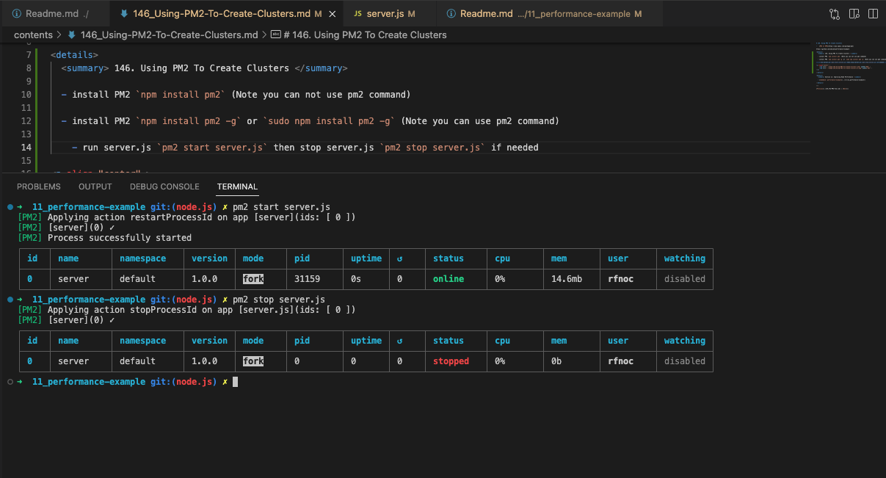

# 147. Managing Live Clusters With PM2

https://github.com/odziem/performance-example

<details>
  <summary> 147. Managing Live Clusters With PM2 </summary>

- server.js
```
const express = require('express');

const app = express();

function delay (duration){
    const startTime = Date.now();
    while(Date.now() - startTime < duration) {
        // event loop is blocked....
    }
}

app.get('/', (req, res) => {
    res.send(`Performance example: ${process.pid}`);
});

app.get('/timer', (req, res) => {
    delay(9000);
    res.send(`Ding ding ding! ${process.pid}`);
});

console.log('Running sever.js...')
console.log('Worker process started.');
app.listen(3000);
```

- install PM2 `npm install pm2` (Note you can not use pm2 command)

- install PM2 `npm install pm2 -g` or `sudo npm install pm2 -g` (Note you can use pm2 command)

- run server.js `pm2 start server.js` then stop server.js `pm2 stop server.js` if needed

<p align="center" >
     
     
</p>  

- run server.js `pm2 start server.js -i max` 

<p align="center" >
     
</p>   

- run server.js `pm2 logs` 

<p align="center" >
     
</p>     

-  run `pm2 start server.js -l logs.txt -i max`

<p align="center" >
     
</p>     

-  run `pm2 show 0`

<p align="center" >
     
</p>    

-  run `pm2 list`

<p align="center" >
     
</p>    

-  run `pm2 stop 4` and `pm2 start 4`

<p align="center" >
     
</p>    

-  run `pm2 monit`

<p align="center" >
     
</p>    

</details>    

<details>
  <summary> Section 11: Improving Node Performance </summary>

  - [Codebase: performance-example](../src/s11_performance-example/)

</details>

---

[Previous](./146_Using-PM2-To-Create-Clusters.md) | [Next](./148_Zero-Downtime-Restart.md)