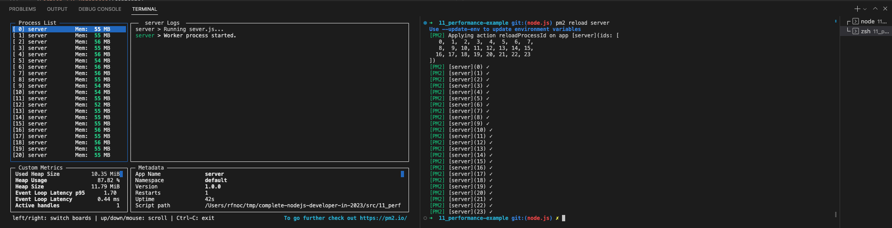

# 148. Zero Downtime Restart

-   [Bonus: Deployment Strategies on Google cloud](https://cloud.google.com/architecture/application-deployment-and-testing-strategies)

https://github.com/odziem/performance-example

  
 148. Zero Downtime Restart 

  - run server.js `pm2 monit` and `pm2 reload server`

     

   

  
 Section 11: Improving Node Performance 

- [Codebase: performance-example](../src/11_performance-example/)

---

[Previous](./147_Managing-Live-Clusters-With-PM2.md) | [Next]()