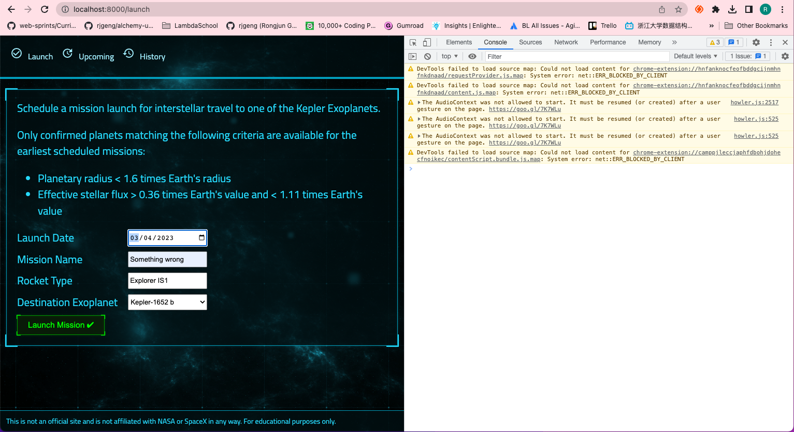
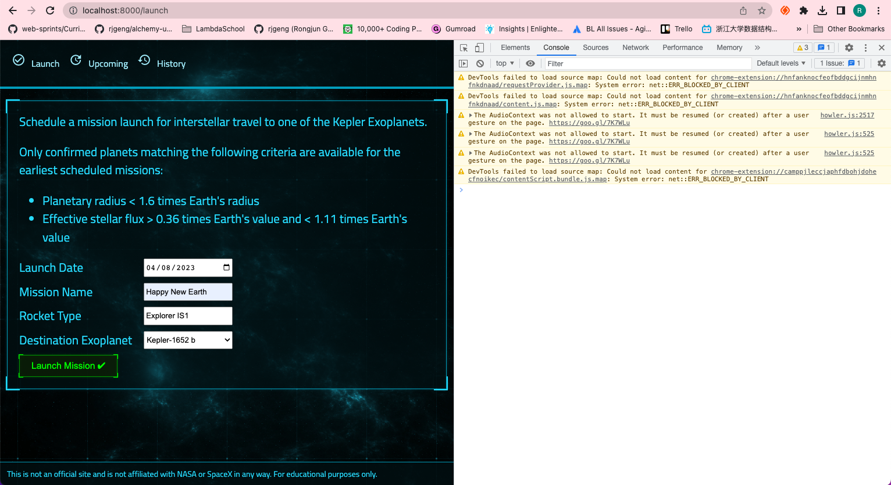
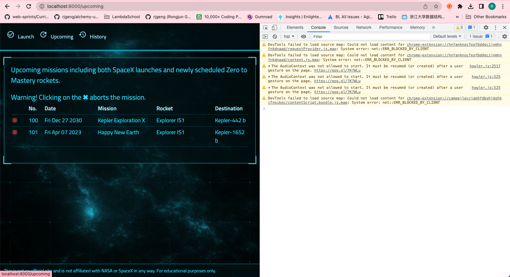

# 149. Improving Performance Of Our NASA Project

https://github.com/odziem/nasa-project

**server**

- install pm2 on server `sudo npm i pm2 -g`

- add script `"cluster": "pm2 start src/server.js -i max"` on package.json

**project root**

-   add script `"deploy-cluster": "npm run build --prefix client && npm run cluster --prefix server",` on **project root** `package.json`

  
 result - capture 

-   goto `http://localhost:8000/launch` add two launches --> `http://localhost:8000/upcoming` only two not three launches ???

     
     
     

 

  

  
 Section 11: Improving Node Performance 

  - [Codebase: performance-example](../src/s11_performance-example/)

---

[Previous](./148_Zero-Downtime-Restart.md) | [Next](./150_Worker-Threads.md)