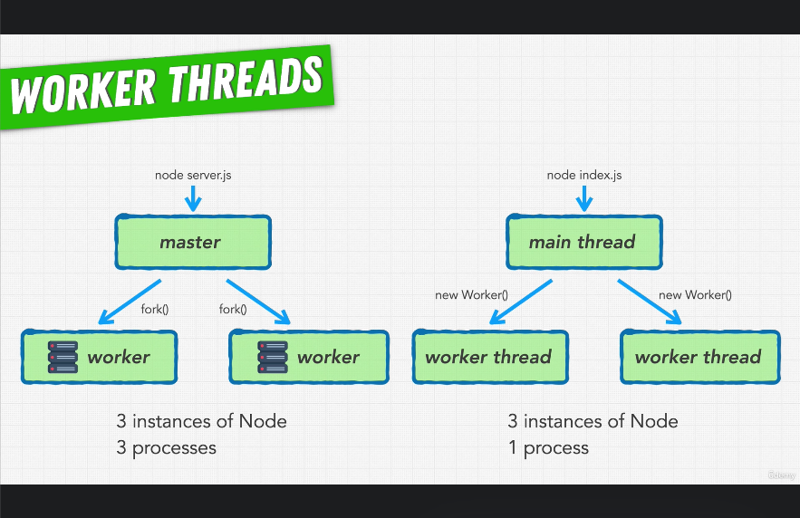

# 150. Worker Threads

-   [Node Worker Threads](https://nodejs.org/api/worker_threads.html)

-   [Web Worker API For Browsers](https://developer.mozilla.org/en-US/docs/Web/API/Web_Workers_API)

     

 

https://github.com/odziem/nasa-project

https://github.com/odziem/performance-example

  
 11_nasa-project-pm2 

  - [Codebase: nasa-project-pm2](../src/11_nasa-project-pm2/)

  
 Section 11: Improving Node Performance 

  - [Codebase: performance-example](../src/s11_performance-example/)

---

[Previous](./149_Improving-Performance-Of-Our-NASA-Project.md) | [Next](./151_Worker-Threads-In-Action.md)