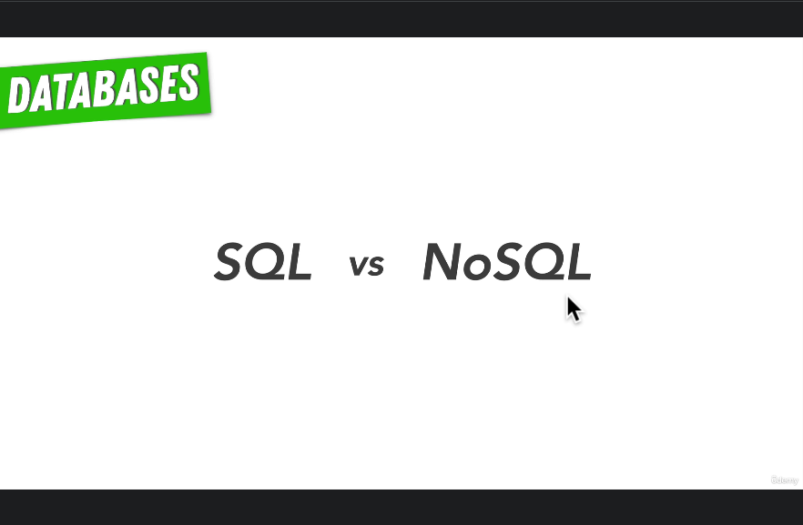
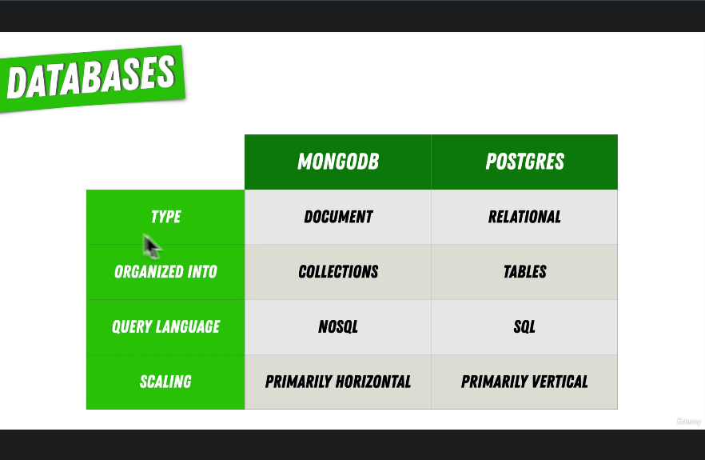
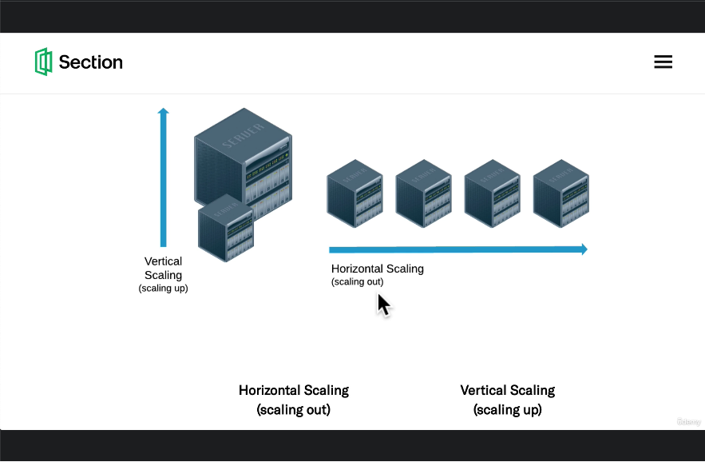

# 154. Comparing SQL vs NoSQL

     
     
     

 

https://github.com/r-spacex/SpaceX-API

  
 Section 12: Databases 

  - [Codebase: SpaceX-API](../src/s12_SpaceX-API/)

---

[Previous](./153_Recommended-Path_SQL.md) | [Next](./155_Database-Schemas-%26-Schemaless-Databases.md)