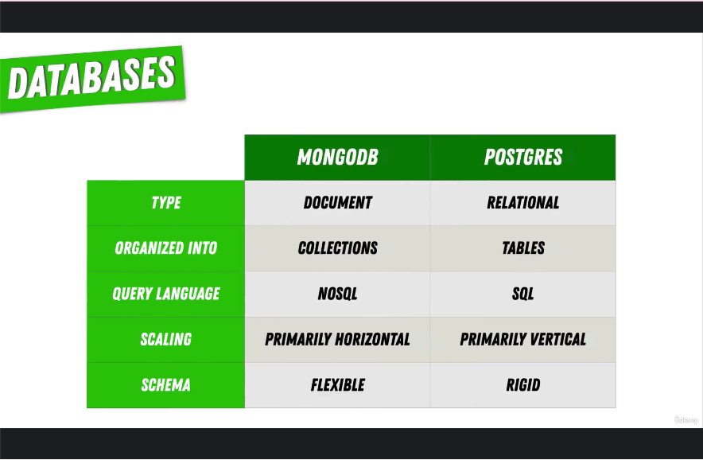

# 155. Database Schemas & Schemaless Databases

     

 

https://github.com/r-spacex/SpaceX-API

  
 Section 12: Databases 

  - [Codebase: SpaceX-API](../src/s12_SpaceX-API/)

---

[Previous](./154_Comparing-SQL-vs-NoSQL.md) | [Next](./156_Choosing-a-Database-for-our-NASA-Project.md)