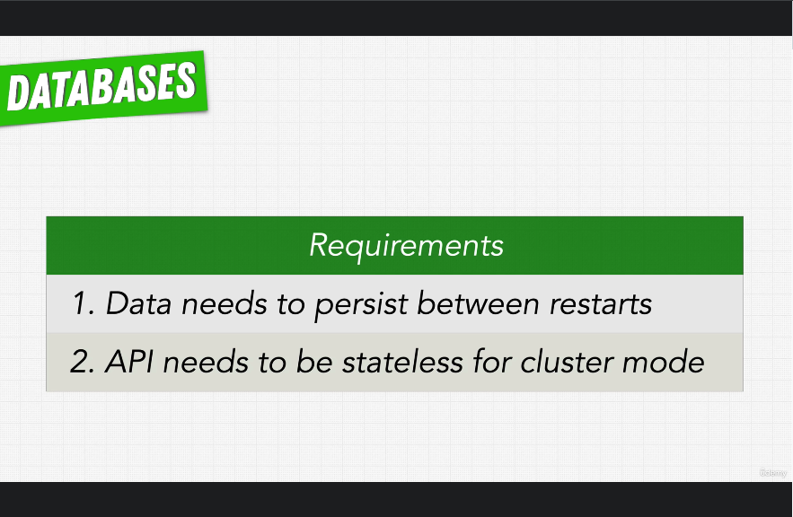

# 156. Choosing a Database for our NASA Project

     

 

https://github.com/r-spacex/SpaceX-API

  
 Section 12: Databases 

  - [Codebase: SpaceX-API](../src/s12_SpaceX-API/)

---

[Previous](./155_Database-Schemas-%26-Schemaless-Databases.md) | [Next](./157_SQL-vs-MongoDB_Trends-and-Object-Relational-Impedance-Mismatch.md)