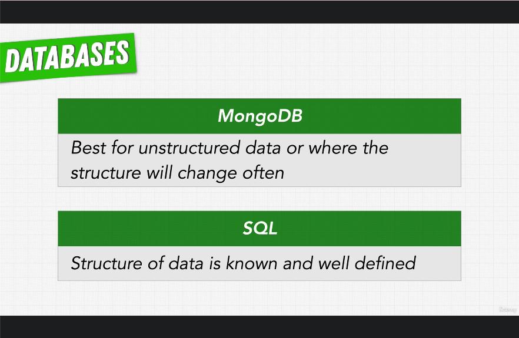

# 158. SQL vs MongoDB: Schemas, References, and ACID Transactions

-   [ACID properties of transactions](https://www.ibm.com/docs/en/cics-ts/5.4?topic=processing-acid-properties-transactions)

     

 

https://github.com/r-spacex/SpaceX-API

  
 Section 12: Databases 

  - [Codebase: SpaceX-API](../src/s12_SpaceX-API/)

---

[Previous](./157_SQL-vs-MongoDB_Trends-and-Object-Relational-Impedance-Mismatch.md) | [Next](./159_Setting-up-MongoDB-Atlas.md)