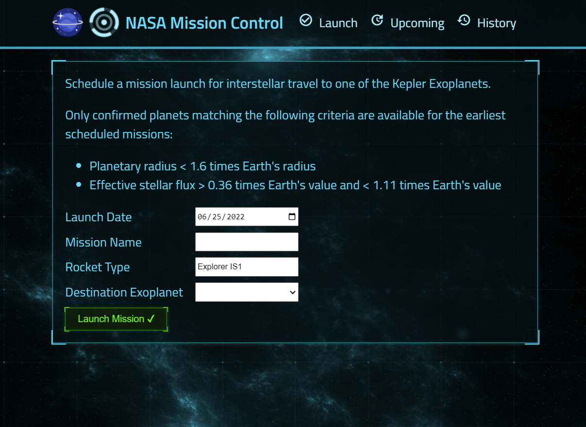

#   165. Reminder: Destination Planets Dropdown

**Friendly reminder!** If you load the front end and you see an empty list of planets in the Destination dropdown on the launch page:

<p align="center" >
     
</p> 

You will need to `npm run deploy` again to update the public folder in the server directory.

Remember, we've updated the dropdown in the Launch.js file in our client folder to use `planet.keplerName` instead of `planet.kepler_name`. If we don't run the `npm run deploy` script before running our npm run server script, our server will be referencing an old static file and we'll get blank labels for the planet names.


https://github.com/odziem/nasa-project

<details>
  <summary> 165. Reminder: Destination Planets Dropdown </summary>

-   `server/src/models/planets.mongo.js`

```
const mongoose = require('mongoose');

const planetSchema = new mongoose.Schema({
    keplerName: {
        type: String,
        required: true,
    } 
});

// Connects planetSchema with the "planets" collection
module.exports = mongoose.model('Planet', planetSchema);
```

**Note:** update `client/src/pages/launch.js` to change the name `kepler_name` to `keplerName`  

-   `client/src/pages/launch.js`
```
import { useMemo } from "react";
import { Appear, Button, Loading, Paragraph } from "arwes";
import Clickable from "../components/Clickable";

const Launch = (props) => {
  const selectorBody = useMemo(() => {
    if (!Array.isArray(props.planets)) {
      return null; // or return a default value
    }
    return props.planets.map((planet) => (
      <option value={planet.keplerName} key={planet.keplerName}>
        {planet.keplerName}
      </option>
    ));
  }, [props.planets]);

  const today = new Date().toISOString().split("T")[0];

  return <Appear id="launch" animate show={props.entered}>
    <Paragraph>Schedule a mission launch for interstellar travel to one of the Kepler Exoplanets.</Paragraph>
    <Paragraph>Only confirmed planets matching the following criteria are available for the earliest scheduled missions:</Paragraph>
    <ul>
      <li>Planetary radius &lt; 1.6 times Earth's radius</li>
      <li>Effective stellar flux &gt; 0.36 times Earth's value and &lt; 1.11 times Earth's value</li>
    </ul>

    <form onSubmit={props.submitLaunch} style={{display: "inline-grid", gridTemplateColumns: "auto auto", gridGap: "10px 20px"}}>
      <label htmlFor="launch-day">Launch Date</label>
      <input type="date" id="launch-day" name="launch-day" min={today} max="2040-12-31" defaultValue={today} />
      <label htmlFor="mission-name">Mission Name</label>
      <input type="text" id="mission-name" name="mission-name" />
      <label htmlFor="rocket-name">Rocket Type</label>
      <input type="text" id="rocket-name" name="rocket-name" defaultValue="Explorer IS1" />
      <label htmlFor="planets-selector">Destination Exoplanet</label>
      <select id="planets-selector" name="planets-selector">
        {selectorBody}
      </select>
      <Clickable>
        <Button animate 
          show={props.entered} 
          type="submit" 
          layer="success" 
          disabled={props.isPendingLaunch}>
          Launch Mission ✔
        </Button>
      </Clickable>
      {props.isPendingLaunch &&
        <Loading animate small />
      }
    </form>
  </Appear>
};

export default Launch;
```

**from 163. Creating Mongoose Schema for Launches**
-   `server/src/models/launches.mongo.js`

```
const mongoose = require('mongoose');

const launchesSchema = new mongoose.Schema({
    flightNumber: {
        type: Number,
        required: true,        
    },
    launcheDate: {
        type: Date,
        required: true,
    },
    mission: {
        type: String,
        required: true,
    },
    rocket: {
        type: String,
        required: true,
    },
    target: {
        type: String,
        required: true,
    },  
    customers: [ String ],
    upcoming: {
        type: Boolean,
        required: true,
    },  
    success: {
        type: Boolean,
        required: true,
        default: true
    },  
});

// Connects launchesSchema with the "launches" collection
module.exports = mongoose.model('Launch', launchesSchema);
```

</details>

<details>
  <summary> Section 12: Databases </summary>

  - [Codebase: s12_nasa-project-pm2](../src/s12_nasa-project-pm2/)

</details>

---

[Previous](./163_Creating-Mongoose-Schema-for-Launches.md) | [Next](./166_Creating-Models-From-Schemas.md)