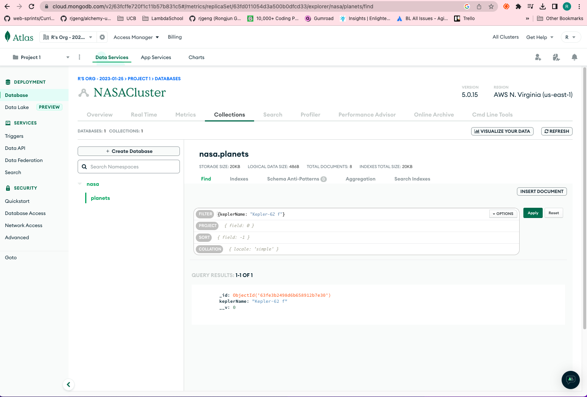

# 171. Exploring Data Using Atlas

https://github.com/odziem/nasa-project

  
 171. Exploring Data Using Atlas 

     

 

  
 Section 12: Databases 

  - [Codebase: s12_nasa-project-pm2](../src/s12_nasa-project-pm2/)

---

[Previous](./170_The-Upsert-Operation.md) | [Next]()