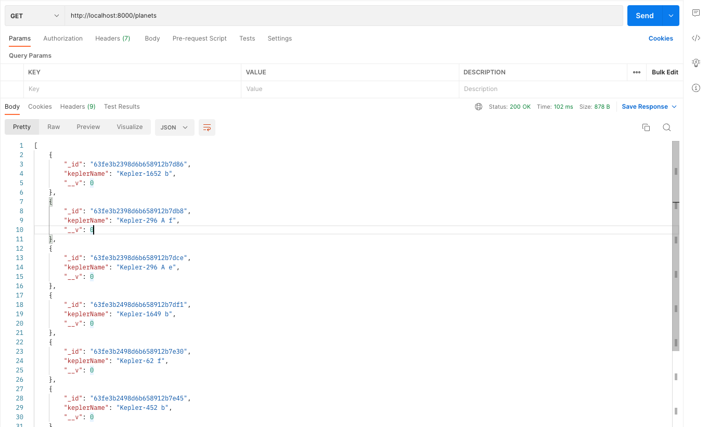
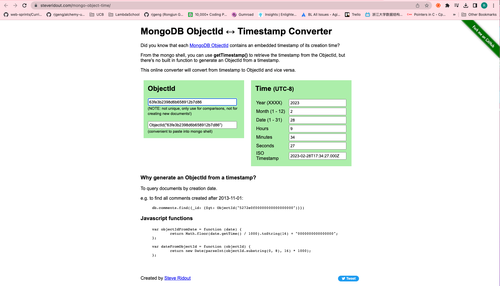

# 173. ObjectIDs

-   [MongoDB ObjectID to Timestamp Converter](https://steveridout.com/mongo-object-time/)

https://github.com/odziem/nasa-project

  
 73. ObjectIDs 

     
     

 

  
 Section 12: Databases 

  - [Codebase: s12_nasa-project-pm2](../src/s12_nasa-project-pm2/)

---

[Previous](./172_Updating-Project-Architecture.md) | [Next](./174_Excluding-Fields-From-The-Response.md)