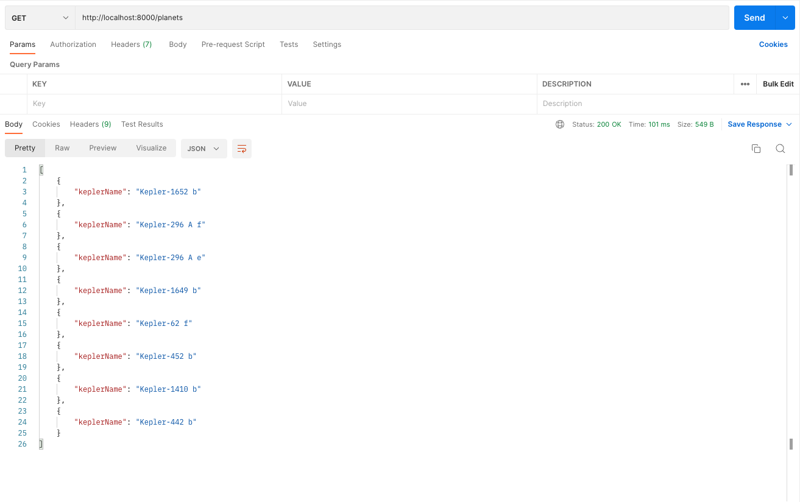

# 174. Excluding Fields From The Response

https://github.com/odziem/nasa-project

<details>
  <summary> 174. Excluding Fields From The Response </summary>

  -   `server/src/models/planets.model.js` updating

  ```
const  { parse } = require('csv-parse');
const fs = require('fs');
const path = require('path');

const planets = require('./planets.mongo');

function isHabitablePlanet(planet) {
    return planet['koi_disposition'] === 'CONFIRMED'
        && planet['koi_insol'] > 0.36 && planet['koi_insol'] < 1.11
        && planet['koi_prad'] < 1.6;
  }
  
function loadPlanetsData(){
    return new Promise((resolve, reject) => {
        fs.createReadStream(path.join(__dirname, '..', '..', 'data', 'kepler_data.csv'))
            .pipe(parse({
                comment: '#',
                columns: true
            }))
            .on('data', async (data) => {
                if (isHabitablePlanet(data)){
                    savePlanet(data);
                }
            })
            .on('error', (err) => {
                console.log(err);
                reject(err);
            })
            .on('end', async () => {        
                const countPlanetsFound = (await getAllPlanets()).length;       
                console.log(`${countPlanetsFound} habitable planets found!`);
                resolve();
            });
    });
}

async function getAllPlanets () {
    return await planets.find({}, {
        '_id': 0, '__v': 0,
    });
};

async function savePlanet(data) {
    try {
        await planets.updateOne({
            keplerName: data.kepler_name,
        }, {
            keplerName: data.kepler_name,
        }, {
            upsert: true,
        });
    } catch (err){
        console.error(`Could not save planet ${err}`);
    }
}

module.exports = {
    loadPlanetsData,
    getAllPlanets,
};
  ```

- on postman `GET http://localhost:8000/planets`

<p align="center" >
     
</p> 

</details>

<details>
  <summary> Section 12: Databases </summary>

  - [Codebase: s12_nasa-project-pm2](../src/s12_nasa-project-pm2/)

</details>

---

[Previous](./173_ObjectIDs.md) | [Next](./175_Saving-Launches.md)