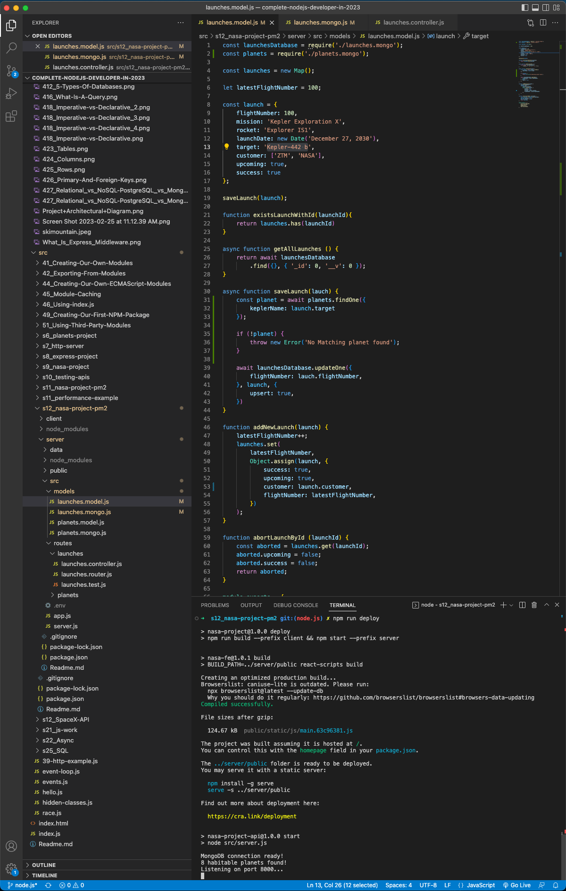
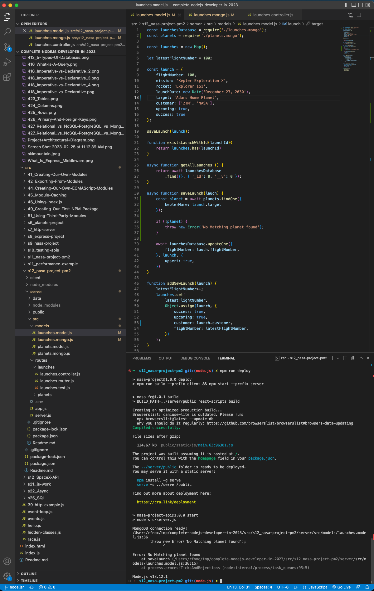

# 177. Referential Integrity

-   [Referential Integrity](https://en.wikipedia.org/wiki/Referential_integrity)

-   [Node.js Best Practices Repo](https://github.com/goldbergyoni/nodebestpractices)


https://github.com/odziem/nasa-project

<details>
  <summary> 177. Referential Integrity </summary>

-   `server/src/models/launches.model.js`  

```
const launchesDatabase = require('./launches.mongo');
const planets = require('./planets.mongo');

const launches = new Map();

let latestFlightNumber = 100;

const launch = {
    flightNumber: 100,
    mission: 'Kepler Exploration X',
    rocket: 'Explorer IS1',
    launchDate: new Date('December 27, 2030'),
    target: 'Adams Home Planet',
    customer: ['ZTM', 'NASA'],
    upcoming: true,
    success: true
};

saveLaunch(launch);

function existsLaunchWithId(launchId){
    return launches.has(launchId)
}

async function getAllLaunches () {
    return await launchesDatabase
        .find({}, { '_id': 0, '__v': 0 });
}

async function saveLaunch(lauch) {
    const planet = await planets.findOne({
        keplerName: launch.target
    });

    if (!planet) {
        throw new Error('No Matching planet found');
    }

    await launchesDatabase.updateOne({
        flightNumber: lauch.flightNumber,
    }, launch, {
        upsert: true,        
    })
}

function addNewLaunch(launch) {
    latestFlightNumber++;
    launches.set(
        latestFlightNumber, 
        Object.assign(launch, {
            success: true,
            upcoming: true,
            customer: launch.customer,
            flightNumber: latestFlightNumber,
        })
    );
}

function abortLaunchById (launchId) {
    const aborted = launches.get(launchId);
    aborted.upcoming = false;
    aborted.success = false;
    return aborted;    
}

module.exports = {
    existsLaunchWithId,
    getAllLaunches,
    addNewLaunch,
    abortLaunchById,
}
```

-   `server/src/routes/launches.controller.js` same 176

-   `server/src/models/planets.model.js` same as updating in  174

</details>

<details>
  <summary> result - capture </summary>

- in `server/src/models/launches.model.js`  change `target: 'Kepler-442 b',` to `target: 'Adams Home Planet',`

- run `npm run deploy` to see the result

<p align="center" >
     
     
</p> 

</details>

<details>
  <summary> Section 12: Databases </summary>

  - [Codebase: s12_nasa-project-pm2](../src/s12_nasa-project-pm2/)

</details>

---

[Previous](./176_Listing-All-Launches.md) | [Next]()

