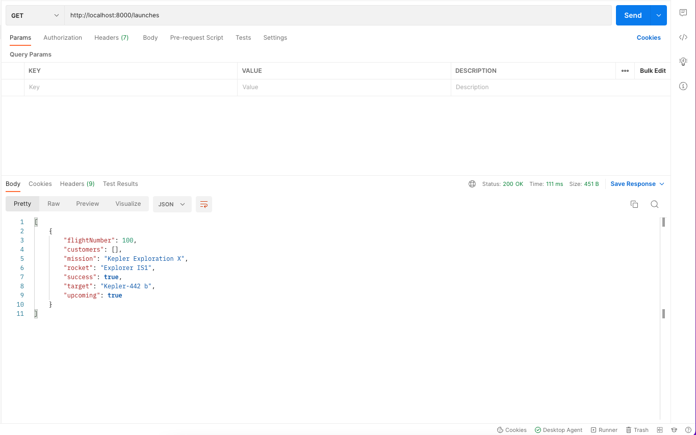

# 177. Referential Integrity

-   [Referential Integrity](https://en.wikipedia.org/wiki/Referential_integrity)

-   [Node.js Best Practices Repo](https://github.com/goldbergyoni/nodebestpractices)


https://github.com/odziem/nasa-project

<details>
  <summary> 177. Referential Integrity </summary>

-   `server/src/models/launches.model.js` 

```
const launchesDatabase = require('./launches.mongo');

const launches = new Map();

let latestFlightNumber = 100;

const launch = {
    flightNumber: 100,
    mission: 'Kepler Exploration X',
    rocket: 'Explorer IS1',
    launchDate: new Date('December 27, 2030'),
    target: 'Kepler-442 b',
    customer: ['ZTM', 'NASA'],
    upcoming: true,
    success: true
};

saveLaunch(launch);

function existsLaunchWithId(launchId){
    return launches.has(launchId)
}

async function getAllLaunches () {
    return await launchesDatabase
        .find({}, { '_id': 0, '__v': 0 });
}

async function saveLaunch(lauch) {
    await launchesDatabase.updateOne({
        flightNumber: lauch.flightNumber,
    }, launch, {
        upsert: true,        
    })
}

function addNewLaunch(launch) {
    latestFlightNumber++;
    launches.set(
        latestFlightNumber, 
        Object.assign(launch, {
            success: true,
            upcoming: true,
            customer: ['Zero to Mastery', 'NASA'],
            flightNumber: latestFlightNumber,
        })
    );
}

function abortLaunchById (launchId) {
    const aborted = launches.get(launchId);
    aborted.upcoming = false;
    aborted.success = false;
    return aborted;    
}

module.exports = {
    existsLaunchWithId,
    getAllLaunches,
    addNewLaunch,
    abortLaunchById,
}
```

-   `server/src/routes/launches.controller.js`
```
const { 
    getAllLaunches, 
    addNewLaunch, 
    existsLaunchWithId,
    abortLaunchById,
} = require('../../models/launches.model');

async function httpGetAllLaunches(req, res) {
    return res.status(200).json(await getAllLaunches());
}

function httpAddNewLaunch (req, res) {
    const launch = req.body;

    if (!launch.mission || !launch.rocket || !launch.launchDate
      || !launch.target) {
        return res.status(400).json({
          error: 'Missing required launch property',
        });
      }
  
    launch.launchDate = new Date(launch.launchDate);
    if (isNaN(launch.launchDate)) {
      return res.status(400).json({
        error: 'Invalid launch date',
      });
    }

    addNewLaunch(launch);
    return res.status(201).json(launch);
}

function httpAbortLaunch (req, res) {
  const launchId = Number(req.params.id);

  if (!existsLaunchWithId(launchId)){
    return res.status(404).json({
      error: 'Lauch not found',
    });
  }

  const aborted = abortLaunchById(launchId);
  return res.status(200).json(aborted);
}

module.exports = {
    httpGetAllLaunches,
    httpAddNewLaunch,
    httpAbortLaunch,
}
```

-   `server/src/models/planets.model.js` updating 174

  ```
const  { parse } = require('csv-parse');
const fs = require('fs');
const path = require('path');

const planets = require('./planets.mongo');

function isHabitablePlanet(planet) {
    return planet['koi_disposition'] === 'CONFIRMED'
        && planet['koi_insol'] > 0.36 && planet['koi_insol'] < 1.11
        && planet['koi_prad'] < 1.6;
  }
  
function loadPlanetsData(){
    return new Promise((resolve, reject) => {
        fs.createReadStream(path.join(__dirname, '..', '..', 'data', 'kepler_data.csv'))
            .pipe(parse({
                comment: '#',
                columns: true
            }))
            .on('data', async (data) => {
                if (isHabitablePlanet(data)){
                    savePlanet(data);
                }
            })
            .on('error', (err) => {
                console.log(err);
                reject(err);
            })
            .on('end', async () => {        
                const countPlanetsFound = (await getAllPlanets()).length;       
                console.log(`${countPlanetsFound} habitable planets found!`);
                resolve();
            });
    });
}

async function getAllPlanets () {
    return await planets.find({}, {
        '_id': 0, '__v': 0,
    });
};

async function savePlanet(data) {
    try {
        await planets.updateOne({
            keplerName: data.kepler_name,
        }, {
            keplerName: data.kepler_name,
        }, {
            upsert: true,
        });
    } catch (err){
        console.error(`Could not save planet ${err}`);
    }
}

module.exports = {
    loadPlanetsData,
    getAllPlanets,
};
  ```

- run `npm run deploy`

```
...
> nasa-project-api@1.0.0 start
> node src/server.js

MongoDB connection ready!
8 habitable planets found!
Listening on port 8000...
```

-   on postman `GET http://localhost:8000/launches`

<p align="center" >
     
</p> 

</details>

<details>
  <summary> Section 12: Databases </summary>

  - [Codebase: s12_nasa-project-pm2](../src/s12_nasa-project-pm2/)

</details>

---

[Previous](./176_Listing-All-Launches.md) | [Next]()

