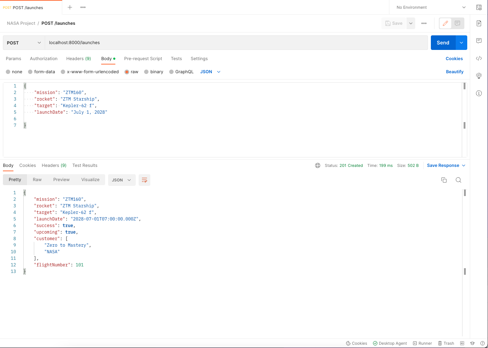

# 180. Scheduling New Launches

https://github.com/odziem/nasa-project

<details>
  <summary>  180. Scheduling New Launches </summary>

-   `server/src/models/launches.model.js` 

```
const launchesDatabase = require('./launches.mongo');
const planets = require('./planets.mongo');

const DEFAULT_FLIGHT_NUMBER = 100;

const launches = new Map();

const launch = {
    flightNumber: 100,
    mission: 'Kepler Exploration X',
    rocket: 'Explorer IS1',
    launchDate: new Date('December 27, 2030'),
    target: 'Kepler-442 b',
    customer: ['ZTM', 'NASA'],
    upcoming: true,
    success: true
};

saveLaunch(launch);

function existsLaunchWithId(launchId){
    return launches.has(launchId)
}

async function getLatestFlightNumber(){
    const latestLaunch = await launchesDatabase
        .findOne()
        .sort('-flightNumber');

    if (!latestLaunch){
        return DEFAULT_FLIGHT_NUMBER;
    }

    return latestLaunch.flightNumber;
}

async function getAllLaunches () {
    return await launchesDatabase
        .find({}, { '_id': 0, '__v': 0 });
}

async function saveLaunch(lauch) {
    const planet = await planets.findOne({
        keplerName: launch.target
    });

    if (!planet) {
        throw new Error('No Matching planet found');
    }

    await launchesDatabase.updateOne({
        flightNumber: lauch.flightNumber,
    }, launch, {
        upsert: true,        
    })
}

async function scheduleNewLaunch(launch) {
    const newFlightNumber = await getLatestFlightNumber() + 1;

    const newLaunch = Object.assign(launch, {
        success: true,
        upcoming: true,
        customer: ['Zero to Mastery', 'NASA'],
        flightNumber: newFlightNumber,
    });

    await saveLaunch(newL);
}

function abortLaunchById (launchId) {
    const aborted = launches.get(launchId);
    aborted.upcoming = false;
    aborted.success = false;
    return aborted;    
}

module.exports = {
    existsLaunchWithId,
    getAllLaunches,
    scheduleNewLaunch,
    abortLaunchById,
}
```

-   `server/src/routes/launches.controller.js`

```
const { 
    getAllLaunches, 
    scheduleNewLaunch, 
    existsLaunchWithId,
    abortLaunchById,
} = require('../../models/launches.model');

async function httpGetAllLaunches(req, res) {
    return res.status(200).json(await getAllLaunches());
}

async function httpAddNewLaunch (req, res) {
    const launch = req.body;

    if (!launch.mission || !launch.rocket || !launch.launchDate
      || !launch.target) {
        return res.status(400).json({
          error: 'Missing required launch property',
        });
      }
  
    launch.launchDate = new Date(launch.launchDate);
    if (isNaN(launch.launchDate)) {
      return res.status(400).json({
        error: 'Invalid launch date',
      });
    }

    await scheduleNewLaunch(launch);
    return res.status(201).json(launch);
}

function httpAbortLaunch (req, res) {
  const launchId = Number(req.params.id);

  if (!existsLaunchWithId(launchId)){
    return res.status(404).json({
      error: 'Lauch not found',
    });
  }

  const aborted = abortLaunchById(launchId);
  return res.status(200).json(aborted);
}

module.exports = {
    httpGetAllLaunches,
    httpAddNewLaunch,
    httpAbortLaunch,
}
```
</details>

<details>
  <summary> result - capture </summary>

- run `npm run deploy` to see the result

```
...
> nasa-project-api@1.0.0 start
> node src/server.js

MongoDB connection ready!
8 habitable planets found!
Listening on port 8000...
```

-   on postman `POST localhost:8000/launches`
```
{
    "mission": "ZTM160",
    "rocket": "ZTM Starship",
    "target": "Kepler-62 f",
    "launchDate": "July 1, 2028"

}
```

<p align="center" >
     
     
</p> 

</details>

<details>
  <summary> Section 12: Databases </summary>

  - [Codebase: s12_nasa-project-pm2](../src/s12_nasa-project-pm2/)

</details>

---

[Previous](./179_Getting-Latest-Flight-Number.md) | [Next](./181_Investigating-A-Mongoose-Mystery.md)
