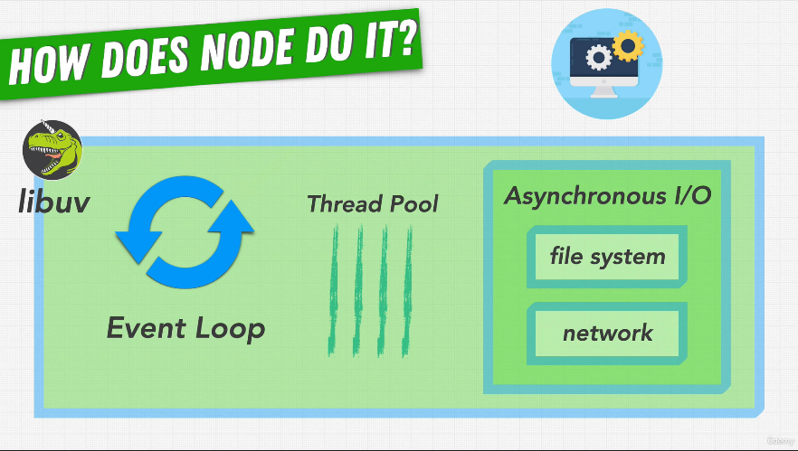

# 29. Is Node.js Multi-Threaded?

**ChatGPT:** Node.js is a single-threaded runtime environment. This means that it runs JavaScript code in a single process, using a single thread of execution.

However, Node.js uses an event-driven, non-blocking I/O model, which makes it possible to handle many concurrent connections and perform many I/O operations without blocking the main thread of execution. This allows Node.js to effectively handle a large number of requests with a small number of threads, making it well suited for highly scalable, high-performance server-side applications.

In Node.js, when a long-running or blocking operation is required, such as reading from the file system or performing a network request, Node.js passes the operation to a separate system thread, allowing the main thread to continue processing events and handling other requests. When the operation is completed, a callback is executed on the main thread to notify the application of the result.

While Node.js is single-threaded, it can take advantage of multiple CPU cores by using the cluster module to run multiple instances of the Node.js process on different cores. This allows Node.js applications to scale across multiple cores, effectively making use of multi-threading in a way that is transparent to the application code.

</a>
 

---

[Previous](./27_Exercise_Is-JavaScript-Asynchronous%3F.md) | [Next](./32_Phases-of-the-Event-Loop.md)