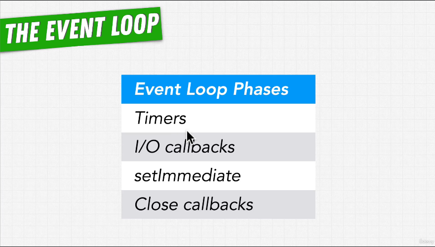
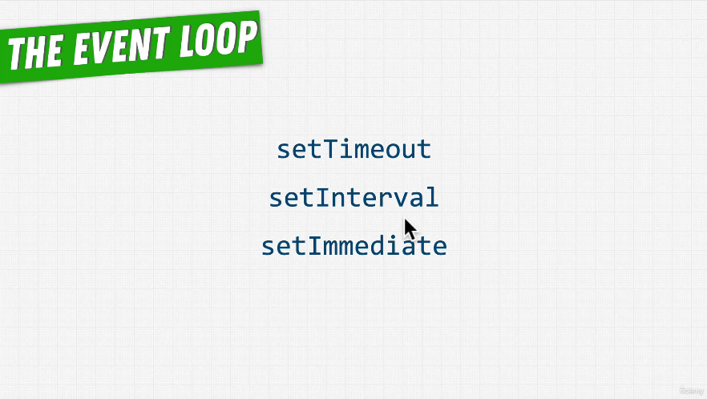
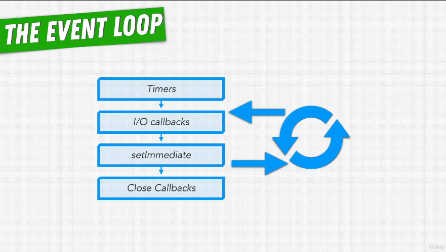

# 32. Phases of the Event Loop

-   [The Node.js Event Loop, Timers, and process.nextTick()](https://nodejs.org/en/docs/guides/event-loop-timers-and-nexttick/)

</a>
 

---

</a>
 

---

</a>
 

---

[Previous](./29_Is-Node.js-Multi-Threaded%3F.md) | [Next](./33_Comparing-Node-With-PHP-and-Python.md)