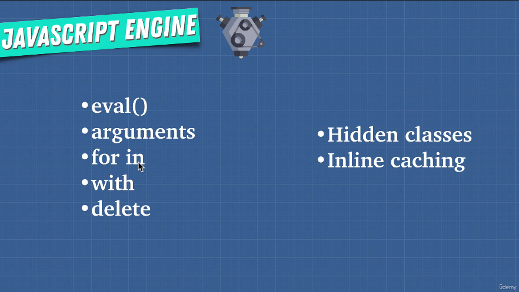

# 359. Writing Optimized Code

-   [Javascript Hidden Classes and Inline Caching in V8](https://richardartoul.github.io/jekyll/update/2015/04/26/hidden-classes.html)

-   [3. Managing arguments](https://github.com/petkaantonov/bluebird/wiki/Optimization-killers#3-managing-arguments)

---

</a>
 

  
 Section 21: Appendix: How Javascript Works 

  - [Codebase: js-work](../src/s21_js-work/)

---

[Previous](./352_JavaScript-Engine.md) | [Next](./364_Memory-Leaks.md)