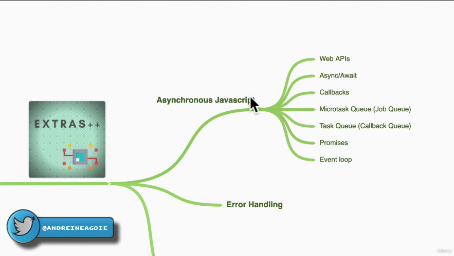

# 371. Section Overview

-   [https://replit.com/@aneagoie/async](https://replit.com/@aneagoie/async)


---

<p align="center" ></a></p> 

---

- 371-section-overview.js
```
setTimeout(() => {console.log('1', 'is the loneliest number')}, 0);
setTimeout(() => {console.log('2', 'can be as bad as one')}, 10);

// 2
Promise.resolve('hi').then((data) => console.log('2', data));

// 3
console.log('3', 'is a crowd');
```

 -  run `node 371-section-overview.js` 
```
3 is a crowd
2 hi
1 is the loneliest number
2 can be as bad as one
```


---

[Previous](./370_Quick-Note_Upcoming-Videos.md) | [Next](./372-Promises.md)