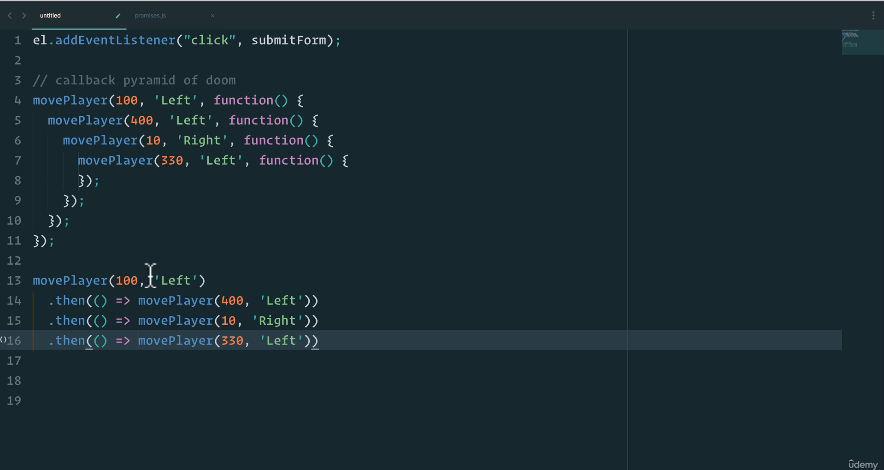
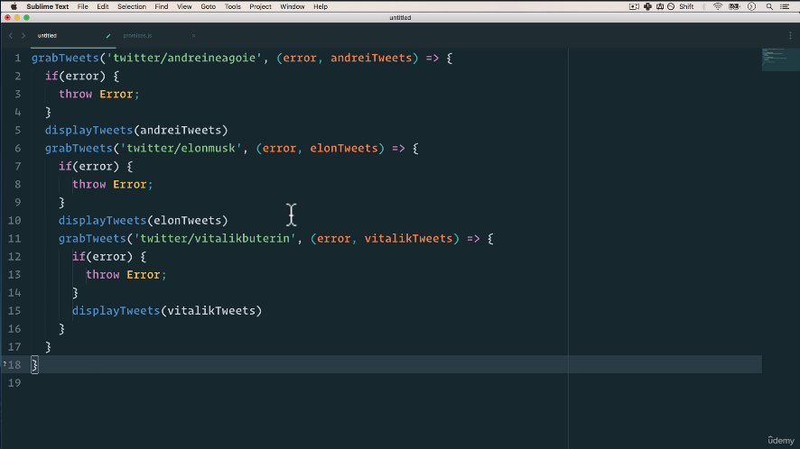
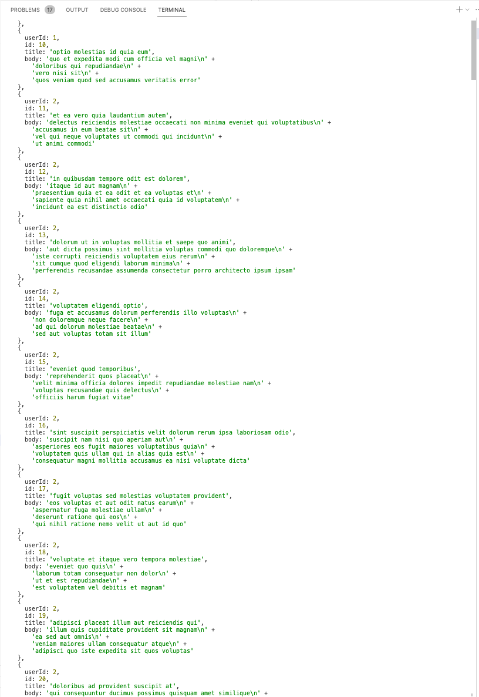

# 372. Promises

<p align="center" >
    
    
</p> 

<details>
  <summary> Example 1 </summary>

- `372-promises.js` 
```
const promise = new Promise((resolve, reject) => {
    if (true) {
        resolve('Stuff Worked');
    } else {
        reject('Error, it broken');
    }
} );

console.log('promise: ', promise);

promise
    .then(result => result + "!")
    .then(result2 => result2 + "?")
    .catch( () => console.log('error!'))
    .then(result3 => { 
        console.log(result3 + "!")
    })
```

-   run `node 372-promises.js `
```
promise:  Promise { 'Stuff Worked' }
Stuff Worked!?!
```
</details>

<details>
  <summary> Example 2 </summary>

- `372-promises.js` 
```
const promise = new Promise((resolve, reject) => {
    if (true) {
        resolve('Stuff Worked');
    } else {
        reject('Error, it broken');
    }
} );

const promise2 = new Promise((resolve, reject) => {
    setTimeout(resolve, 100, "HIII")    
} );

const promise3 = new Promise((resolve, reject) => {
    setTimeout(resolve, 1000, "POOKIE")    
} );

const promise4 = new Promise((resolve, reject) => {
    setTimeout(resolve, 3000, "Is it me you are looking for?")    
} );

Promise.all([promise, promise2, promise3, promise4])
    .then(values => {
        console.log(values);
    })
```

-   run `node 372-promises.js `
```
[ 'Stuff Worked', 'HIII', 'POOKIE', 'Is it me you are looking for?' ]
```
</details>

<details>
  <summary> Example 3 </summary>

-   [https://jsonplaceholder.typicode.com/](https://jsonplaceholder.typicode.com/)  

- `372-promises.js` 
```
const urls = [
    'https://jsonplaceholder.typicode.com/users',
    'https://jsonplaceholder.typicode.com/posts',
    'https://jsonplaceholder.typicode.com/albums'
]

// console.log(fetch('https://jsonplaceholder.typicode.com/users'), Promise);

Promise.all(urls.map(urls => {
    return fetch(urls).then(resp => resp.json())
})). then( results => {
    console.log(results[0]);
    console.log(results[1]);
    console.log(results[2]);
}).catch( err => console.error('err.message: ', err.message));
```

-   run `node 372-promises.js `

---

<p align="center" ></a></p> 

---

</details>

<details>
  <summary> Section 22: Appendix: Asynchronous JavaScript </summary>

  - [Codebase: Async](../src/s22_Async/)

</details>


---

[Previous](./371_Section-Overview.md) | [Next](./373_ES8-Async-Await.md)

