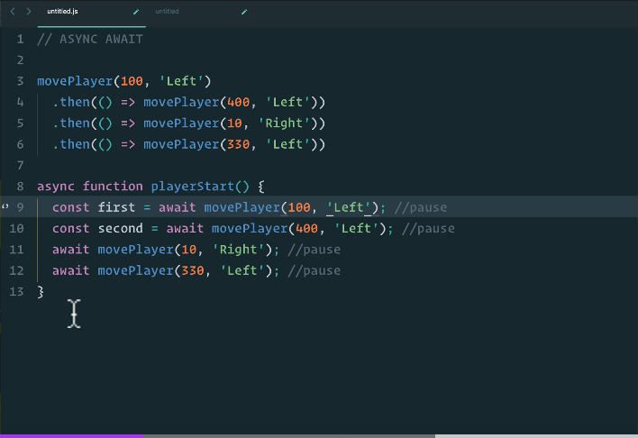
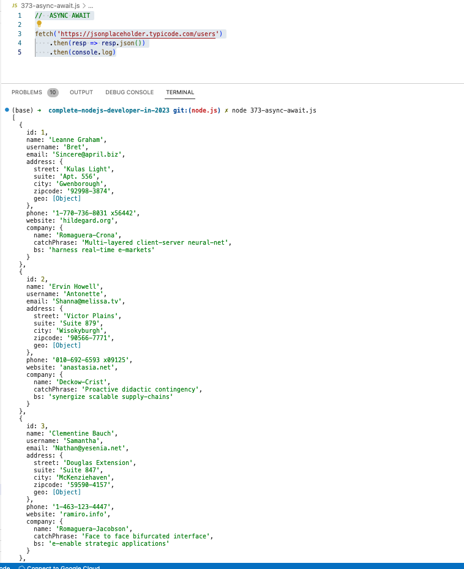
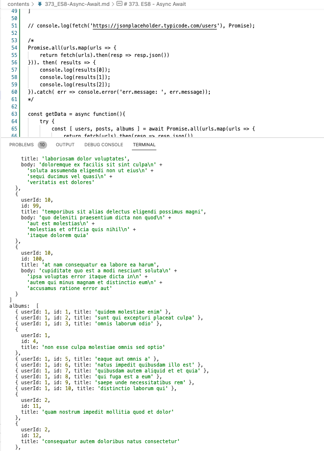

# 373. ES8 - Async Await

<p align="center" >
    
</p> 

<details>
  <summary> Example 1 </summary>

-   [https://jsonplaceholder.typicode.com/](https://jsonplaceholder.typicode.com/)  

- `372-promises.js` 
```
//  ASYNC AWAIT
/*
fetch('https://jsonplaceholder.typicode.com/users')
    .then(resp => resp.json())
    .then(console.log)
*/

async function fetchUser() {
    const resp = await fetch('https://jsonplaceholder.typicode.com/users');
    const data = await resp.json();
    console.log(data)
}

fetchUser();
```

-   run `node 372-promises.js `

---

<p align="center" ></a></p> 
</details>

<details>
  <summary> Example 2 </summary>

-   [https://jsonplaceholder.typicode.com/](https://jsonplaceholder.typicode.com/)  

- `372-promises.js` 
```
//  ASYNC AWAIT
const urls = [
    'https://jsonplaceholder.typicode.com/users',
    'https://jsonplaceholder.typicode.com/posts',
    'https://jsonplaceholder.typicode.com/albums'
]

// console.log(fetch('https://jsonplaceholder.typicode.com/users'), Promise);

/* 
Promise.all(urls.map(urls => {
    return fetch(urls).then(resp => resp.json())
})). then( results => {
    console.log(results[0]);
    console.log(results[1]);
    console.log(results[2]);
}).catch( err => console.error('err.message: ', err.message));
*/

const getData = async function(){
    try {
        const [ users, posts, albums ] = await Promise.all(urls.map(urls => {
            return fetch(urls).then(resp => resp.json())
        }))
        console.log('users: ', users);
        console.log('posts: ', posts);
        console.log('albums: ', albums);
    } catch {
        console.log('oops')
    }
}

getData()
```

-   run `node 372-promises.js `

---

<p align="center" ></a></p> 
</details>


<details>
  <summary> Section 22: Appendix: Asynchronous JavaScript </summary>

  - [Codebase: Async](../src/s22_Async/)

</details>


---

[Previous](./372-Promises.md) | [Next](./374_ES9-(ES2018).md)