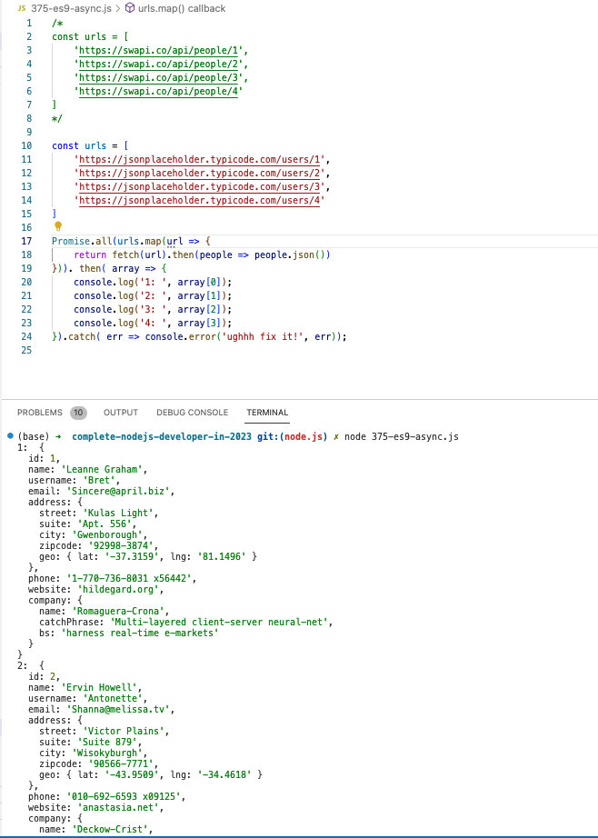
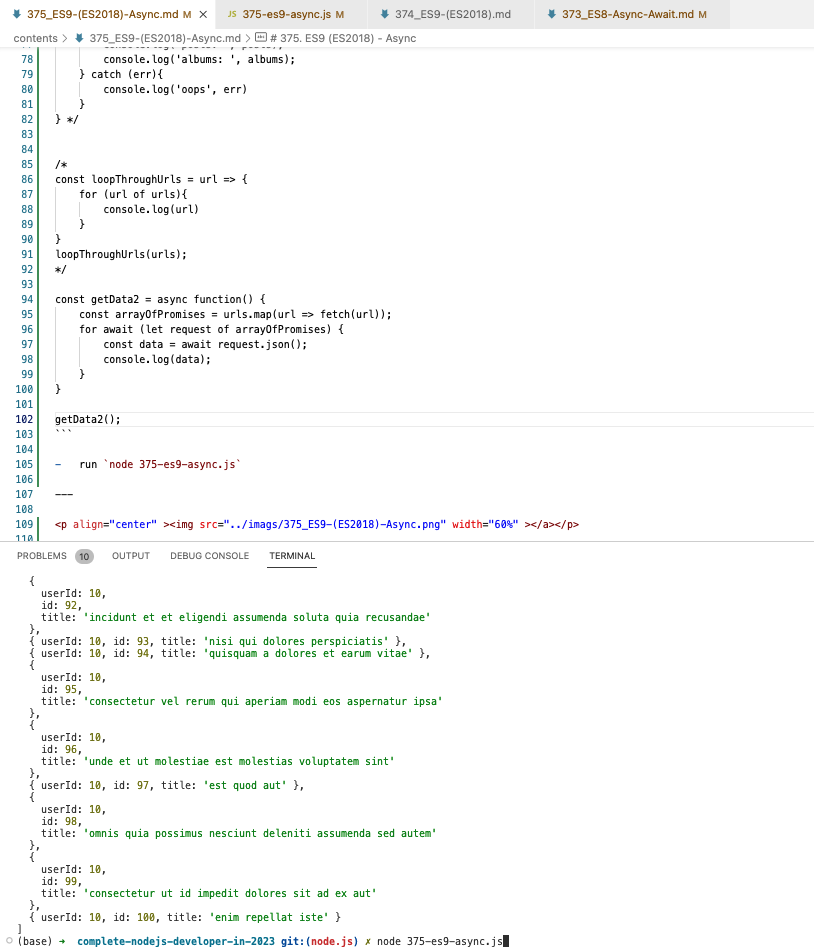

# 375. ES9 (ES2018) - Async

-   [https://pipedream.com/apps/swapi](https://pipedream.com/apps/swapi)

-   [Getting data from Swapi API https://swapi.co/api/people/](https://stackoverflow.com/questions/47365401/getting-data-from-swapi-api-https-swapi-co-api-people)

<details>
  <summary> Example 1 </summary>

-   [https://pipedream.com/apps/swapi](https://pipedream.com/apps/swapi)

-   [Getting data from Swapi API https://swapi.co/api/people/](https://stackoverflow.com/questions/47365401/getting-data-from-swapi-api-https-swapi-co-api-people)

-   [https://jsonplaceholder.typicode.com/](https://jsonplaceholder.typicode.com/)  

- `375-es9-async.js` 
```
// finally()
/* 
const urls = [
    'https://swapi.co/api/people/1',
    'https://swapi.co/api/people/2',
    'https://swapi.co/api/people/3',
    'https://swapi.co/api/people/4'
] 
*/

const urls = [
    'https://jsonplaceholder.typicode.com/users/1',
    'https://jsonplaceholder.typicode.com/users/2',
    'https://jsonplaceholder.typicode.com/users/3',
    'https://jsonplaceholder.typicode.com/users/4'
] 

Promise.all(urls.map(url => {
    return fetch(url).then(people => people.json())
}))
    . then( array => {
        console.log('1: ', array[0]);
        console.log('2: ', array[1]);
        console.log('3: ', array[2]);
        console.log('4: ', array[3]);
})
    .catch( err => console.error('ughhh fix it!', err))
    .finally( () => console.log('extra: '));
```

-   run `node 375-es9-async.js`

---

<p align="center" ></a></p> 

</details>

<details>
  <summary> Example 2 </summary>

-   [https://jsonplaceholder.typicode.com/](https://jsonplaceholder.typicode.com/)  

- `375-es9-async.js` 
```
// for await of 
const urls = [
    'https://jsonplaceholder.typicode.com/users',
    'https://jsonplaceholder.typicode.com/posts',
    'https://jsonplaceholder.typicode.com/albums'
]

const getData = async function(){
    try {
        const [ users, posts, albums ] = await Promise.all(urls.map(urls => {
            return fetch(urls).then(resp => resp.json())
        }))
        console.log('users: ', users);
        console.log('posts: ', posts);
        console.log('albums: ', albums);
    } catch (err){
        console.log('oops', err)
    }
} 

// getData();

/* 
const loopThroughUrls = url => {
    for (url of urls){
        console.log(url)
    }
}
loopThroughUrls(urls);
*/

const getData2 = async function() {
    const arrayOfPromises = urls.map(url => fetch(url));
    for await (let request of arrayOfPromises) {
        const data = await request.json();
        console.log(data);
    }
}
 
getData2();
```

-   run `node 375-es9-async.js`

---

<p align="center" ></a></p> 

</details>

<details>
  <summary> Section 22: Appendix: Asynchronous JavaScript </summary>

  - [Codebase: Async](../src/s22_Async/)

</details>


---

[Previous](./374_ES9-(ES2018).md) | [Next](./376_Job-Queue.md)