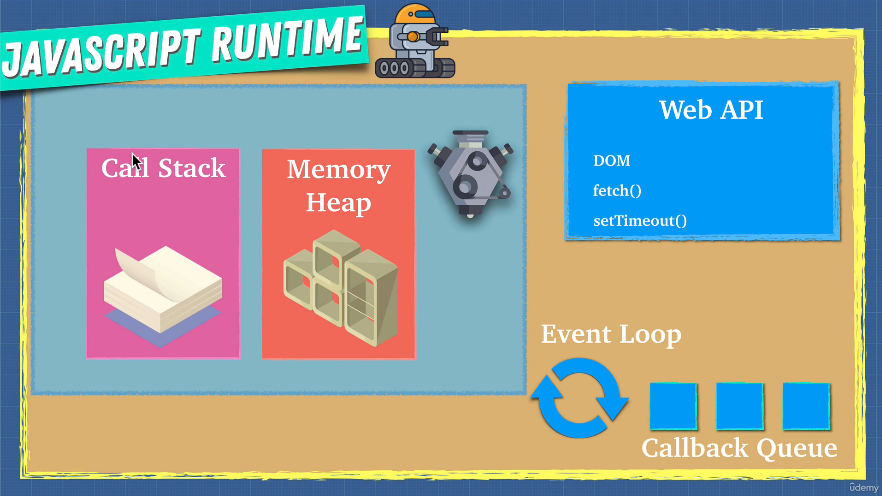

# 376. Job Queue

-   [https://replit.com/@aneagoie/async](https://replit.com/@aneagoie/async)

-   [371. Section Overview](371_Section-Overview.md)

-   [367. Javascript Runtime](367_Javascript-Runtime.md)

<p align="center" >


</a></p> 

-   376-jobQueue.js
```
// Callback Queue - Task Queue
setTimeout(() => {console.log('1', 'is the loneliest number')}, 0);
setTimeout(() => {console.log('2', 'can be as bad as one')}, 10);

// 2 Job Queue - MicroTask Queue
Promise.resolve('hi').then((data) => console.log('2', data));

// 3
console.log('3', 'is a crowd');
```

-  run `node 376-jobQueue.js` 
```
3 is a crowd
2 hi
1 is the loneliest number
2 can be as bad as one
```

---

[Previous](./375_ES9-(ES2018)-Async.md) | [Next](./377_Parallel-Sequence-and-Race.md)