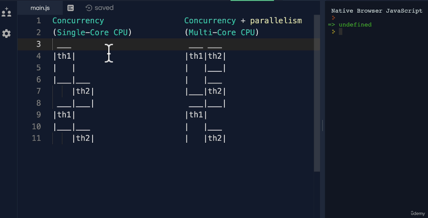
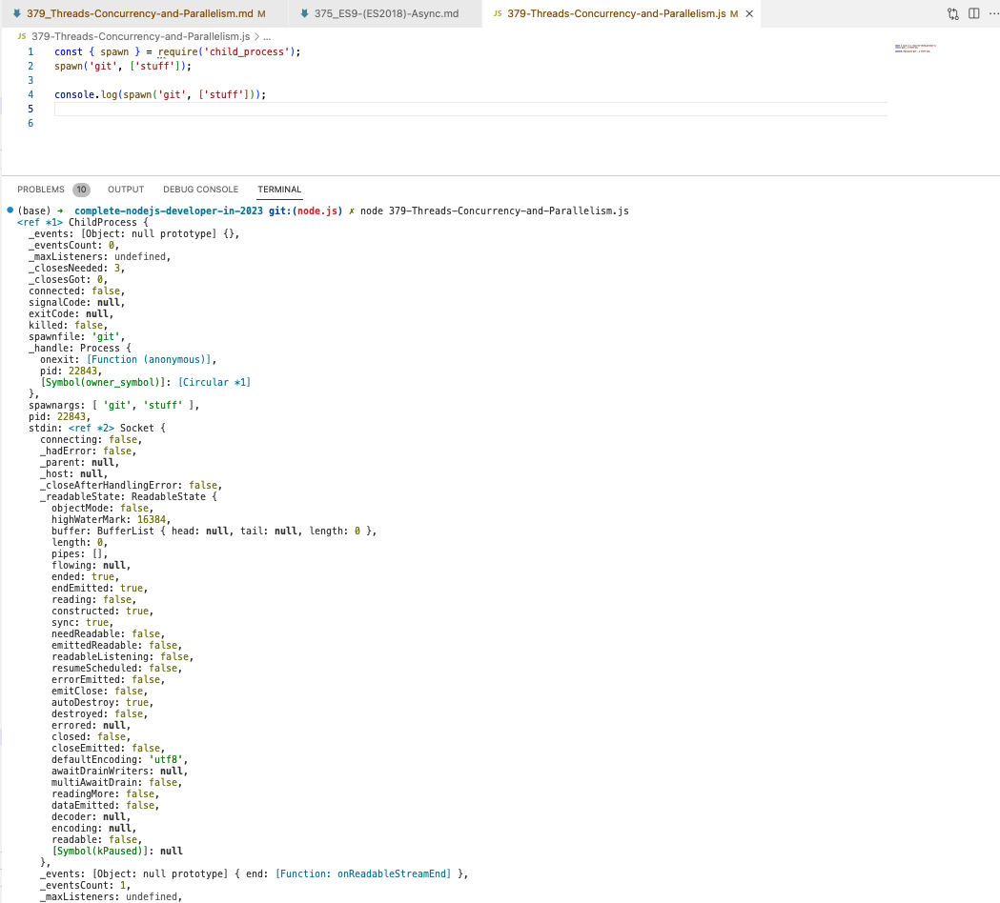

# 379. Threads, Concurrency and Parallelism

-   [Scaling Node.js Applications](https://www.freecodecamp.org/news/scaling-node-js-applications-8492bd8afadc/)

-   [368. Node.js](368_Node.js.md)

---

<p align="center" ></a></p> 

---

<details>
  <summary> Example 1 </summary>

-  `379-Threads-Concurrency-and-Parallelism.js`
```
const { spawn } = require('child_process');
spawn('git', ['stuff']);

console.log(spawn('git', ['stuff']));
```

- run `node 379-Threads-Concurrency-and-Parallelism.js`

<p align="center" ></a></p> 

</details>

---

[Previous](./378_ES2020_allSettled().md) | [Next](./380_Recommended-Path_Back-To-Node.md)