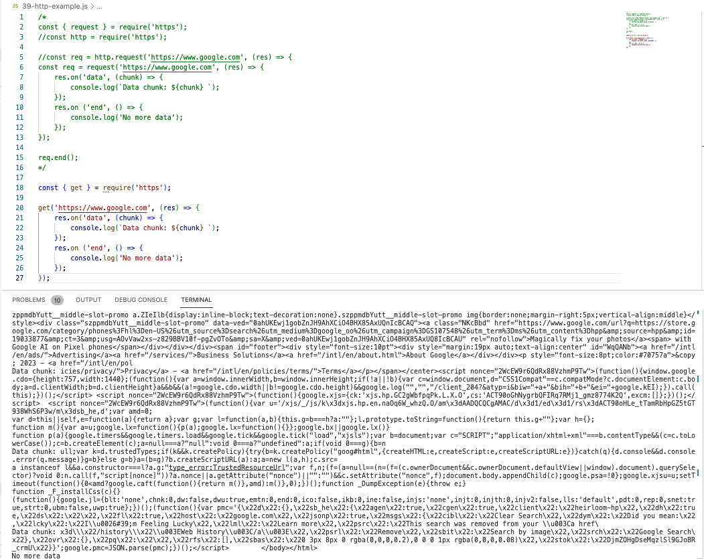

# 39. Making HTTP Requests


<details>
  <summary> Example 1 </summary>

- `39-http-example.js` 
```
/* 
const { request } = require('https');
//const http = require('https');

//const req = http.request('https://www.google.com', (res) => {
const req = request('https://www.google.com', (res) => {
    res.on('data', (chunk) => {
        console.log(`Data chunk: ${chunk} `);
    });
    res.on ('end', () => {
        console.log('No more data');
    });
});

req.end();
*/

const { get } = require('https');

get('https://www.google.com', (res) => {
    res.on('data', (chunk) => {
        console.log(`Data chunk: ${chunk} `);
    });
    res.on ('end', () => {
        console.log('No more data');
    });
});
```

-   run `node 39-http-example.js`

<p align="center" ></a></p> 

</details>

---

[Previous](38_The-require-Function.md) | [Next](39_Making-HTTP-Requests.md)