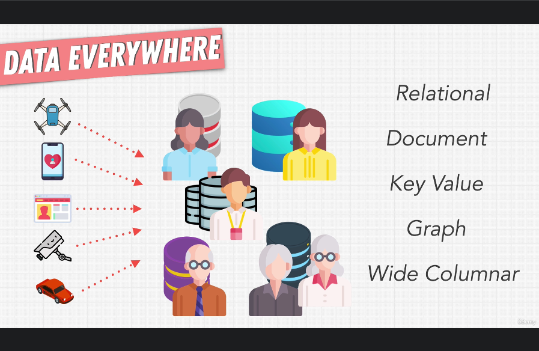

# 412. 5 Types Of Databases

-   [https://www.ibm.com/cloud/blog/brief-overview-database-landscape](https://www.ibm.com/cloud/blog/brief-overview-database-landscape)

    

 

  
 Section 25: Appendix: SQL 

  - [Codebase: SQL](../src/s25_SQL/)

---

[Previous](./411_Exercise_Building-Amazon-2.md) | [Next](./413_Exercise_What-Is-A-Database%3F.md)