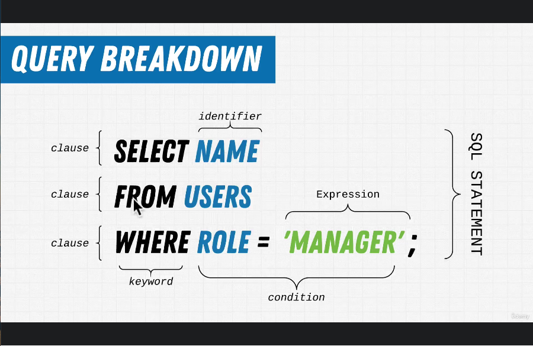

# 416. What Is A Query?
-   [https://www.udemy.com/course/complete-nodejs-developer-zero-to-mastery/learn/lecture/26127764#notes](https://www.udemy.com/course/complete-nodejs-developer-zero-to-mastery/learn/lecture/26127764#notes)

    

 

  
 Section 25: Appendix: SQL 

  - [Codebase: SQL](../src/s25_SQL/)

---

[Previous](./415_What-Is-SQL%3F.md) | [Next](./417_Exercise_Setting-Up-Your-First-Database.md)
