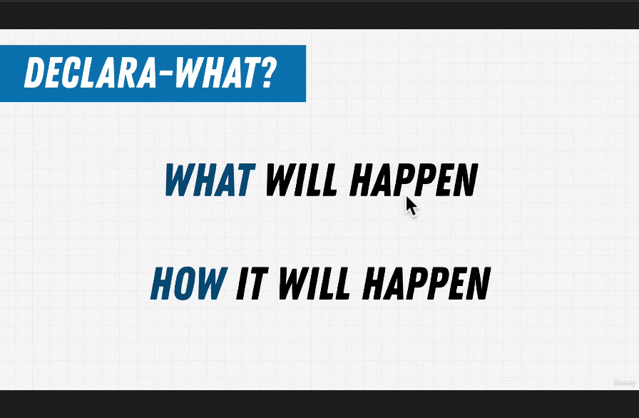
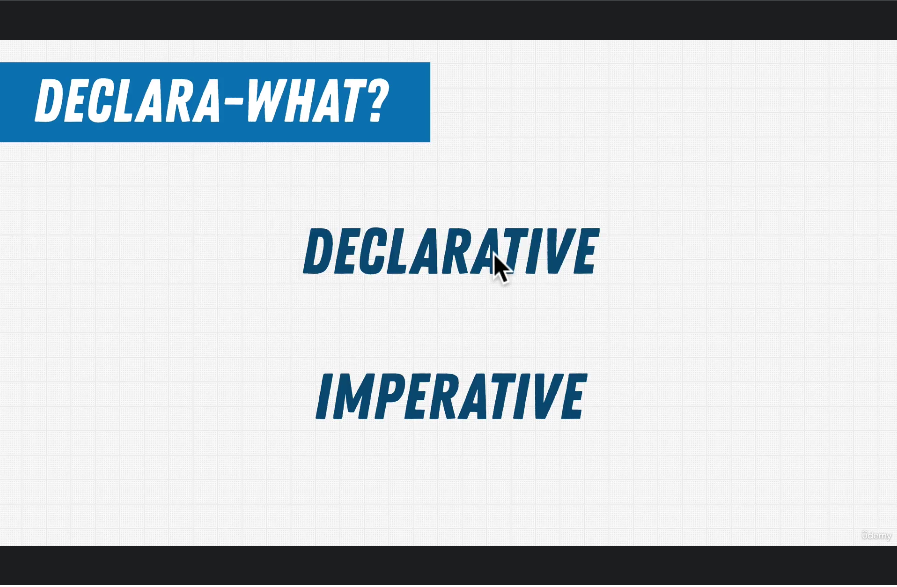
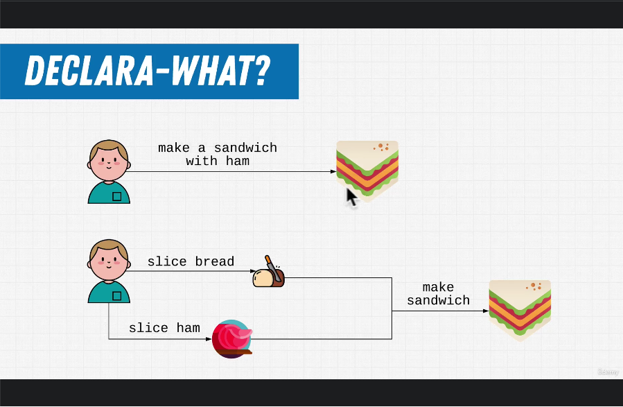
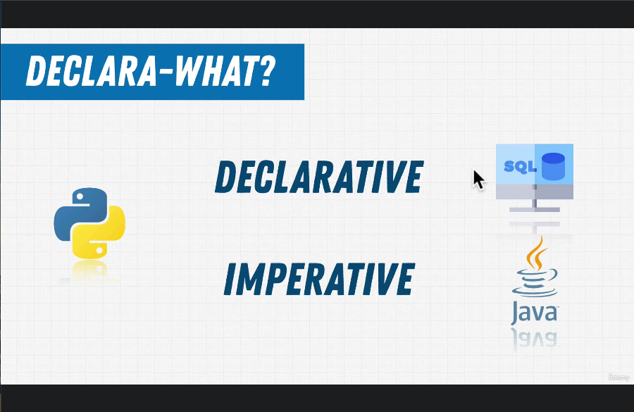

# 418. Imperative vs Declarative

    
    

 

    
    

 

  
 Section 25: Appendix: SQL 

  - [Codebase: SQL](../src/s25_SQL/)

---

[Previous](./417_Exercise_Setting-Up-Your-First-Database.md) | [Next]()