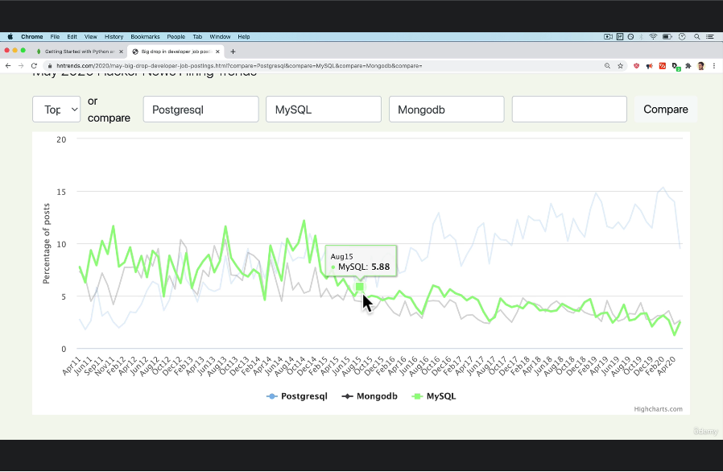
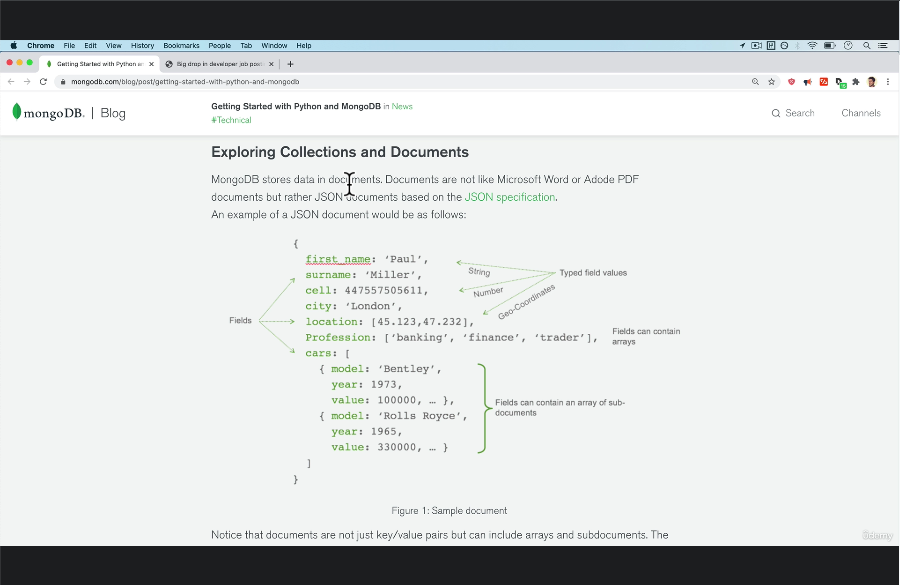

# 427. Relational vs NoSQL, PostgreSQL vs MongoDB Databases

    

 

    

 

  
 Section 25: Appendix: SQL 

  - [Codebase: SQL](../src/s25_SQL/)

---

[Previous](./426_Primary-And-Foreign-Keys.md) | [Next](./428_Scalability.md)