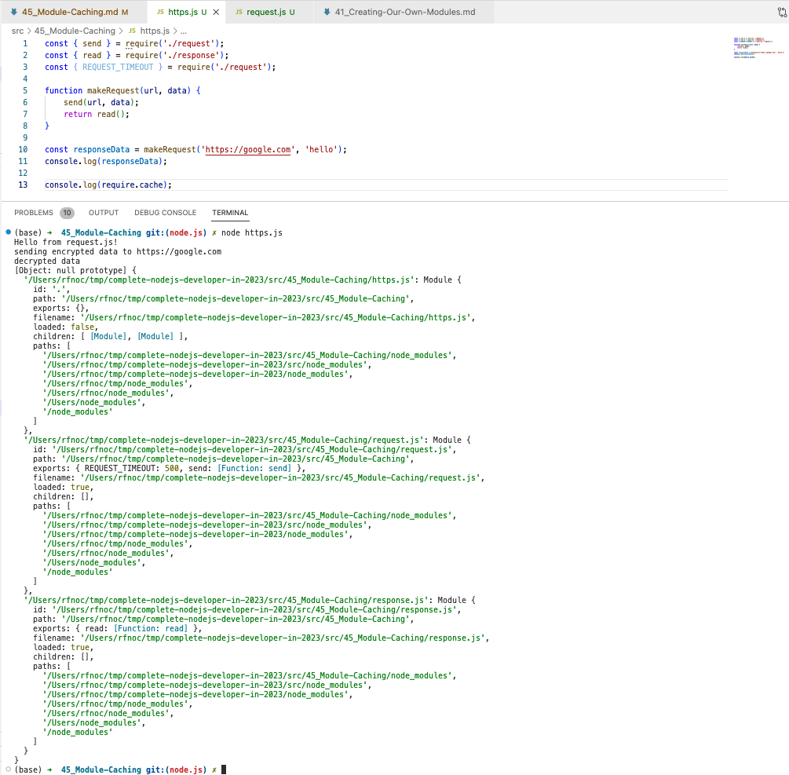

# 45. Module Caching

<details>
  <summary> Example 1 </summary>

- `http.js` 
```
const { send } = require('./request');
const { read } = require('./response');
const { REQUEST_TIMEOUT } = require('./request'); // intend error to load `request` twice to see wether double show on result 

function makeRequest(url, data) {
    send(url, data);
    return read();
}

const responseData = makeRequest('https://google.com', 'hello');
console.log(responseData);

console.log(require.cache);
```

---

- `request.js`
```
const REQUEST_TIMEOUT = 500;

function encrypt (data){
    return "encrypted data";
}

function send(url, data){
    const encryptedData = encrypt(data);
    console.log(`sending ${encryptedData} to ${url}`);
}

module.exports = {
    REQUEST_TIMEOUT,
    send,
}

console.log('Hello from request.js!'); // test to see wether double load!
```

---

- `response.js`
```
function decrpt(data) {
    return 'decrypted data'
}

function read() {
    return decrpt('data')
}

module.exports = {
    read,
}
```

- `https-customer.js`
```
const request = require('./request');

request.send = function() {
    console.log('custom send function');
}

request.send();
```

---

-   run `node http.js`

<p align="center" ></a></p> 

---

-   run `node https-customer.js`
```
Hello from request.js!
custom send function
```
  
</details>

---

[Previous](./44_Creating-Our-Own-ECMAScript-Modules.md) | [Next](./46_Using-index.js.md)