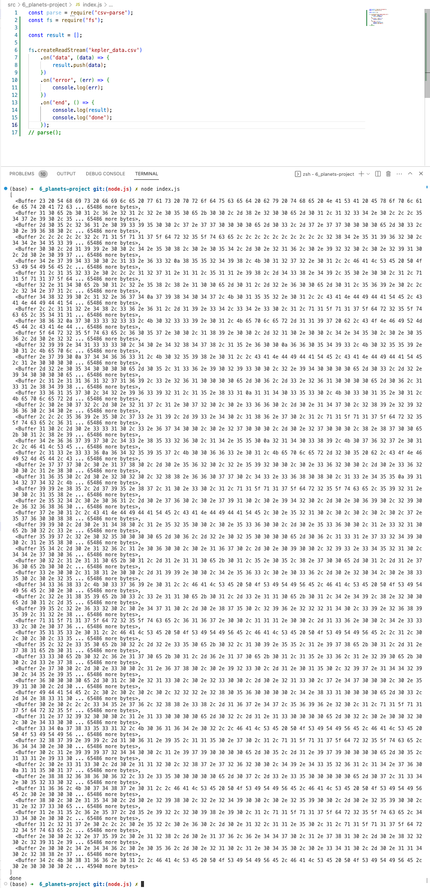

# 64. Reading Our Planets Data

-   [Creating Read Streams in Node](https://nodejs.org/api/fs.html#fs_fs_createreadstream_path_options)

https://github.com/odziem/planets-project

  
 64. Reading Our Planets Data - Result capture 

  ---

  -   run `node index.js`

  
</a>

  ---

  
 Section 6: Node.js File I/O - Planets Project 

  - [Codebase: planets-project](../src/6_planets-project/)

---

[Previous](./63_Streaming-Large-Data-Files.md) | [Next]()