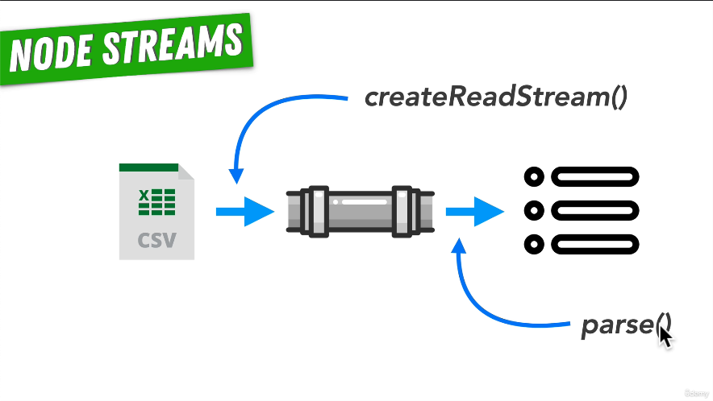
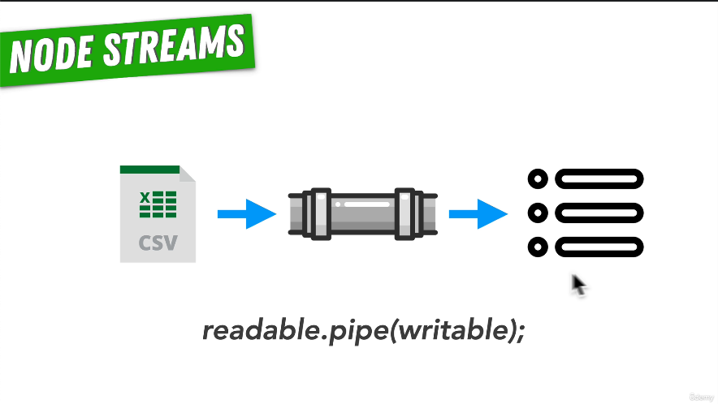
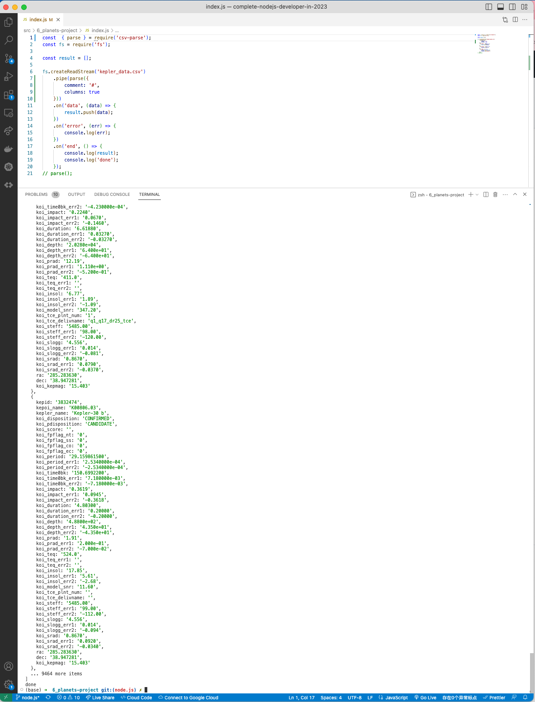

# 65. Parsing Our Planets Data

 <p align="center" >
    
    
 </a></p>

---

https://github.com/odziem/planets-project

<details>
  <summary> 65. Parsing Our Planets Data - Result capture </summary>

  - `index.js`
  ```
  const  { parse } = require('csv-parse');
  const fs = require('fs');

  const result = [];

  fs.createReadStream('kepler_data.csv')
      .pipe(parse({
          comment: '#',
          columns: true
      }))
      .on('data', (data) => {
          result.push(data);
      })
      .on('error', (err) => {
          console.log(err);
      })
      .on('end', () => {
          console.log(result);
          console.log('done');
      });
  // parse();
  ```

  ---

  -   run `node index.js`

  <p align="center" ></a></p>

  ---

</details>

<details>
  <summary> Section 6: Node.js File I/O - Planets Project </summary>

  - [Codebase: planets-project](../src/6_planets-project/)

</details>


---

[Previous](./64_Reading-Our-Planets-Data.md) | [Next](./66_Finding-Habitable-Planets.md)