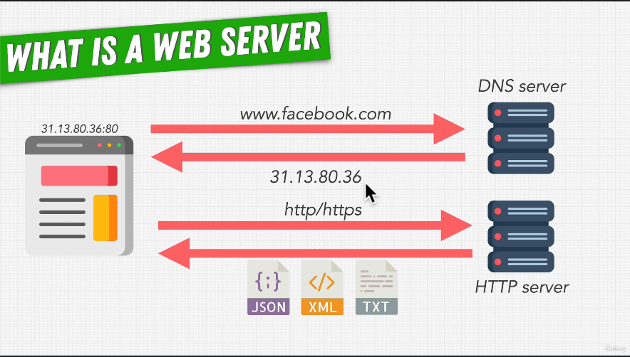

# 70. Introduction to HTTP Responses and Requests

-   [HTTP request methods](https://developer.mozilla.org/en-US/docs/Web/HTTP/Methods)

---

---

https://github.com/odziem/http-server

  
 Section 7: Web Server with Node.js 

  - [Codebase: http-server](../src/s7_http-server/)

---

[Previous](./69_What-is-a-Web-Server%3F.md) | [Next](./71_HTTP-Requests.md)