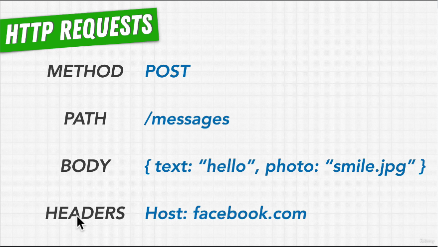

# 71. HTTP Requests

-   [What is an API?](https://www.mulesoft.com/resources/api/what-is-an-api)

---

    
    

---

https://github.com/odziem/http-server

---

  
 Section 7: Web Server with Node.js 

  - [Codebase: http-server](../src/s7_http-server/)

---

[Previous](./70_Introduction-to-HTTP-Responses-and-Requests.md) | [Next](./72_HTTP-Responses.md)